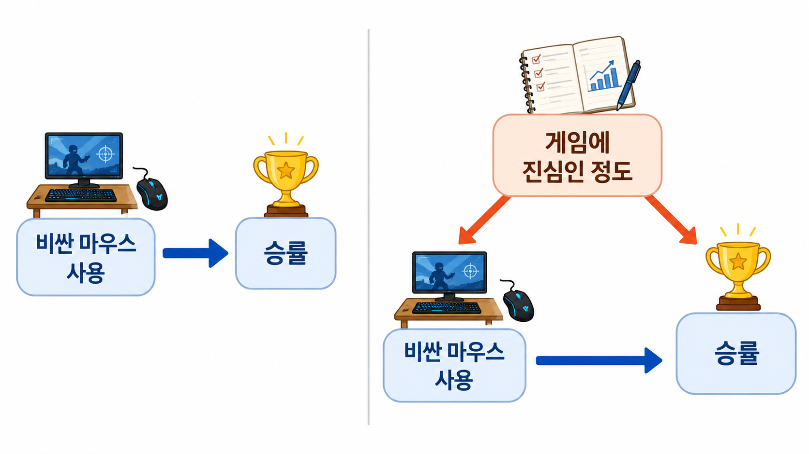

# 4장. 숨은 원인이 비교를 속이는 방식

## 장비가 아니라 진심의 차이라면?

지금까지 우리는 새 마우스 예시를 계속 봤다.

처음에는 이런 숫자가 있었다.

| 플레이어 그룹 | 비싼 마우스 사용 | 평균 승률 |
| --- | --- | ---: |
| A 그룹 | 예 | 68% |
| B 그룹 | 아니오 | 49% |

차이는 19%p였다.

```text
68% - 49% = 19%p
```

이 숫자만 보면 비싼 마우스가 엄청난 효과를 낸 것처럼 보인다.

하지만 이제는 바로 믿지 않는다.

우리는 이미 물어야 할 질문을 안다.

> 두 그룹은 마우스 말고도 정말 비슷한가?

이번에는 이 질문을 더 자세히 보자.

비싼 마우스를 쓰는 사람들은 왜 비싼 마우스를 샀을까?

단순히 돈이 많아서일 수도 있다.

하지만 이런 이유도 가능하다.

> 게임에 진심인 사람이 장비도 사고, 연습도 많이 하고, 승률도 높다.

그러면 마우스와 승률 사이에 다른 이유가 끼어든다.

마우스가 승률을 올린 것처럼 보이지만, 사실은 `게임에 진심인 정도`가 둘 다 움직였을 수 있다.

## 둘 다 움직이는 이유가 있다

비싼 마우스 사용과 승률을 바로 이어 보면 이렇게 보인다.

```text
비싼 마우스 사용 -> 승률
```

이 그림만 보면 마우스가 승률을 바꾸는 것 같다.

하지만 숨은 이유가 있으면 그림이 달라진다.

```text
게임에 진심인 정도 -> 비싼 마우스 사용
게임에 진심인 정도 -> 승률
```

게임에 진심인 사람은 장비를 더 잘 산다.

동시에 더 많이 연습하고, 공략을 찾아보고, 감도 세팅도 맞춘다.

그러면 승률도 높아진다.

이때 비싼 마우스 그룹과 기존 마우스 그룹은 처음부터 다르다.

마우스만 다른 것이 아니다.

게임에 쏟는 시간과 관심도 다르다.

그래서 평균 차이는 다시 위험해진다.

## 화살표는 범인을 찾는 표시다

이제 그림을 조금 더 정리해 보자.

화살표는 “앞의 것이 뒤의 것을 바꿀 수 있다”는 표시다.

```text
게임에 진심인 정도 -> 비싼 마우스 사용
게임에 진심인 정도 -> 승률
비싼 마우스 사용 -> 승률
```

여기에는 길이 두 개 있다.

첫 번째 길은 우리가 알고 싶은 길이다.

```text
비싼 마우스 사용 -> 승률
```

이 길은 마우스가 승률을 얼마나 바꾸는지 말한다.

두 번째 길은 우리를 속이는 길이다.

```text
비싼 마우스 사용 <- 게임에 진심인 정도 -> 승률
```

이 길은 마우스 효과가 아니다.

게임에 진심인 사람이 마우스도 사고 승률도 높기 때문에 생긴 길이다.

우리가 평균 차이를 보면 이 두 길이 섞인다.

그래서 화살표 그림은 예쁜 그림이 아니라, 숫자를 속이는 길을 찾는 도구다.

아래 그림의 왼쪽은 겉으로 보이는 단순한 비교다. 오른쪽은 그 비교 뒤에서 `게임에 진심인 정도`가 장비와 승률을 둘 다 움직일 수 있다는 점을 보여준다.



## 둘 다 움직이면 비교가 어려워진다

비싼 마우스 사용과 승률을 둘 다 움직이는 숨은 이유를 **교란요인**이라고 부른다.

영어로는 `confounder`다.

교란요인은 이런 역할을 한다.

```text
처치에도 영향을 준다.
결과에도 영향을 준다.
```

여기서 처치는 비싼 마우스 사용이다.

결과는 승률이다.

`게임에 진심인 정도`는 둘 다 움직인다.

그래서 교란요인이 될 수 있다.

교란요인이 있으면, 처치를 받은 그룹과 받지 않은 그룹은 처음부터 다르다.

이 차이가 평균 차이에 끼어든다.

1장에서 봤던 말로 쓰면 이렇게 된다.

```text
관측된 평균 차이 = 실제 효과 + 원래 있었던 차이
```

교란요인은 바로 `원래 있었던 차이`를 만드는 대표적인 이유다.

## 작은 숫자로 보면 더 잘 보인다

플레이어를 두 부류로 나눠 보자.

- 게임에 진심인 사람
- 가볍게 하는 사람

각 부류 안에서 마우스 효과는 5%p라고 해 보자.

| 플레이어 유형 | 마우스 | 평균 승률 |
| --- | --- | ---: |
| 진심인 사람 | 비싼 마우스 | 70% |
| 진심인 사람 | 기존 마우스 | 65% |
| 가볍게 하는 사람 | 비싼 마우스 | 50% |
| 가볍게 하는 사람 | 기존 마우스 | 45% |

각 유형 안에서는 차이가 5%p다.

```text
70% - 65% = 5%p
50% - 45% = 5%p
```

그런데 실제 커뮤니티 자료에서는 유형이 섞여 있다.

비싼 마우스 그룹에는 진심인 사람이 많다.

기존 마우스 그룹에는 가볍게 하는 사람이 많다.

예를 들어 이렇게 모였다고 하자.

| 그룹 | 진심인 사람 | 가볍게 하는 사람 |
| --- | ---: | ---: |
| 비싼 마우스 그룹 | 8명 | 2명 |
| 기존 마우스 그룹 | 2명 | 8명 |

그러면 평균은 이렇게 보인다.

```text
비싼 마우스 그룹 평균 = 66%
기존 마우스 그룹 평균 = 49%
차이 = 17%p
```

각 유형 안의 효과는 5%p였다.

그런데 전체 평균 차이는 17%p로 커졌다.

왜 그럴까?

비싼 마우스 그룹에 원래 잘할 사람이 더 많이 들어 있었기 때문이다.

이 17%p를 전부 마우스 효과로 보면 속는다.

## 같은 유형 안에서 비교해야 한다

교란요인이 보이면 비교 방식을 바꿔야 한다.

비싼 마우스 사용자 전체와 기존 마우스 사용자 전체를 바로 비교하지 않는다.

먼저 비슷한 사람끼리 나눈다.

```text
진심인 사람끼리 비교한다.
가볍게 하는 사람끼리 비교한다.
```

그러면 방금 봤던 숫자는 이렇게 읽힌다.

| 비교 | 차이 |
| --- | ---: |
| 진심인 사람 안에서 비교 | 5%p |
| 가볍게 하는 사람 안에서 비교 | 5%p |

이 비교가 더 낫다.

마우스 말고 크게 달랐던 `게임에 진심인 정도`를 맞춰 놓고 봤기 때문이다.

이런 일을 **통제**한다고 말한다.

영어로는 `control`이다.

통제는 아무 변수나 많이 넣는 일이 아니다.

비교를 망가뜨리는 차이를 잠시 같다고 놓고 보는 일이다.

## 그림으로 보면 길을 막는 일이다

교란요인이 있을 때 문제의 길은 이것이었다.

```text
비싼 마우스 사용 <- 게임에 진심인 정도 -> 승률
```

`게임에 진심인 정도`를 맞춰 놓고 비교하면 이 길이 약해진다.

진심인 사람끼리 비교하면, 양쪽 모두 게임에 진심이다.

가볍게 하는 사람끼리 비교하면, 양쪽 모두 가볍게 한다.

그러면 이런 식의 차이가 줄어든다.

```text
비싼 마우스 그룹은 원래 더 진심이었다.
```

이제 남는 질문은 더 단순해진다.

> 비슷한 정도로 게임에 진심인 사람들 사이에서도, 비싼 마우스를 쓰면 승률이 더 높은가?

이 질문이 우리가 원래 묻고 싶었던 질문에 더 가깝다.

## 직접 계산해 보면

아래 코드는 전체 평균 차이와 유형 안에서 비교한 차이가 얼마나 다른지 보여준다.

```python
players = []

def add_players(player_type, mouse, win_rate, count):
    for _ in range(count):
        players.append({
            "type": player_type,
            "mouse": mouse,
            "win_rate": win_rate,
        })

add_players("serious", "expensive", 70, 8)
add_players("casual", "expensive", 50, 2)
add_players("serious", "basic", 65, 2)
add_players("casual", "basic", 45, 8)

def average(rows):
    return sum(row["win_rate"] for row in rows) / len(rows)

expensive = [row for row in players if row["mouse"] == "expensive"]
basic = [row for row in players if row["mouse"] == "basic"]

overall_gap = average(expensive) - average(basic)

serious_gap = average([
    row for row in players
    if row["type"] == "serious" and row["mouse"] == "expensive"
]) - average([
    row for row in players
    if row["type"] == "serious" and row["mouse"] == "basic"
])

casual_gap = average([
    row for row in players
    if row["type"] == "casual" and row["mouse"] == "expensive"
]) - average([
    row for row in players
    if row["type"] == "casual" and row["mouse"] == "basic"
])

overall_gap, serious_gap, casual_gap
```

전체로 보면 차이는 17%p다.

하지만 유형 안에서 비교하면 둘 다 5%p다.

```text
전체 평균 차이 = 17%p
진심인 사람 안에서 차이 = 5%p
가볍게 하는 사람 안에서 차이 = 5%p
```

코드는 새 이야기를 하지 않는다.

표에서 본 착각을 계산으로 다시 확인할 뿐이다.

## 아무거나 맞추면 되는 건 아니다

여기서 조심해야 할 점이 있다.

교란요인을 통제하는 것은 중요하다.

하지만 아무 변수나 통제하면 되는 것은 아니다.

예를 들어 마우스를 바꾼 뒤 생긴 손목 피로를 생각해 보자.

비싼 마우스가 손목 피로를 줄이고, 손목 피로가 줄어서 승률이 오를 수도 있다.

이때 손목 피로는 마우스 효과가 지나가는 중간 길일 수 있다.

그런데 손목 피로를 억지로 같다고 놓고 비교하면, 마우스가 승률에 영향을 주는 길 일부를 지워 버릴 수 있다.

그러면 효과를 작게 볼 수 있다.

즉 통제는 많이 할수록 좋은 버튼이 아니다.

어떤 길을 막고 싶은지 알고 골라야 한다.

이번 장에서는 우선 교란요인 하나만 기억하면 된다.

> 처치와 결과를 둘 다 움직이는 숨은 이유가 있으면, 평균 차이는 효과처럼 보이는 가짜 길을 포함한다.

## 여기서 다음 질문이 생긴다

이번 장에서는 숨은 이유가 비교를 속이는 방식을 봤다.

하지만 비교가 망가지는 방식은 이것만이 아니다.

어떤 경우에는 사람을 고르는 방식 자체가 문제를 만든다.

예를 들어 “랭커만 모아서 장비를 비교한다”면 어떨까?

랭커가 되었다는 조건 안에는 실력, 장비, 플레이 시간, 팀운이 이미 복잡하게 섞여 있다.

그 안에서 다시 장비와 승률을 비교하면 이상한 관계가 생길 수 있다.

다음 장에서는 이런 문제를 본다.

> 비교 대상을 고르는 방식은 어떻게 숫자를 속일까?

## 한 줄 요약

교란요인은 처치와 결과를 둘 다 움직이는 숨은 이유이며, 이것을 무시하면 평균 차이에 실제 효과와 원래 차이가 섞인다.
