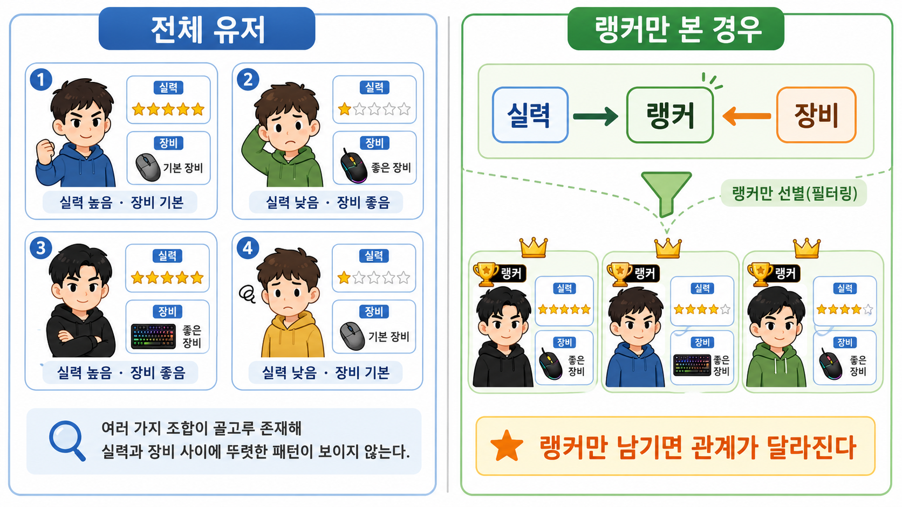

# 5장. 선택 편향은 왜 교란요인과 다른가

## 랭커만 보면 더 정확할까?

4장에서 우리는 숨은 이유를 봤다.

`게임에 진심인 정도`가 비싼 마우스 사용과 승률을 둘 다 움직이면, 평균 차이는 마우스 효과처럼 보이는 다른 차이를 섞는다.

이번에는 조금 다른 문제를 보자.

게임 커뮤니티에서 누군가 이렇게 말한다.

> 전체 유저를 보면 잡음이 많음.
>
> 랭커만 모아서 장비를 비교해야 진짜 장비빨을 볼 수 있음.

처음에는 그럴듯하다.

랭커만 보면 실력이 높은 사람들끼리 비교하니까 더 깔끔할 것 같다.

하지만 바로 여기서 문제가 생길 수 있다.

랭커가 되었다는 조건 자체가 이미 많은 것을 섞고 있기 때문이다.

랭커가 되려면 보통 둘 중 하나 이상이 필요하다.

- 실력이 좋다.
- 장비나 환경이 좋다.

물론 둘 다 좋으면 더 쉽다.

그런데 우리가 `랭커만` 골라 놓으면 이상한 일이 생긴다.

장비가 별로인데도 랭커인 사람은 대체로 실력이 아주 좋을 가능성이 크다.

반대로 실력이 조금 부족해도 장비와 환경이 좋아서 랭커가 된 사람도 있을 수 있다.

이제 랭커 안에서만 보면, 장비와 실력이 서로 이상하게 연결된다.

원래는 없던 비교 문제가 “랭커만 고르는 순간” 생긴다.



왼쪽은 전체 유저를 보는 장면이다.

실력과 장비 조합이 여러 방향으로 섞여 있어서, 둘 사이에 뚜렷한 관계가 보이지 않을 수 있다.

오른쪽은 랭커만 남긴 장면이다.

랭커가 되려면 실력이 좋거나 장비가 좋아야 하므로, 랭커만 남기는 순간 실력과 장비가 서로 관련 있어 보일 수 있다.

## 고르는 순간 관계가 생긴다

전체 유저를 생각해 보자.

비싼 마우스 사용과 실력이 꼭 강하게 연결되어 있지 않을 수 있다.

장비를 좋아하는 초보도 있고, 기본 장비로 잘하는 고수도 있다.

그런데 랭커만 골라 보면 사정이 달라진다.

랭커가 되려면 어떤 식으로든 좋은 결과를 내야 한다.

```text
실력 -> 랭커
장비 -> 랭커
```

여기서 `랭커`는 두 이유가 함께 모이는 지점이다.

실력이 좋아도 랭커가 될 수 있다.

장비가 좋아도 랭커가 될 수 있다.

둘 다 좋으면 더 쉽게 랭커가 된다.

그런데 우리가 랭커만 고르면, 이미 `랭커`라는 조건을 만족한 사람들만 남긴다.

이때 장비가 별로인 랭커를 보면 이렇게 생각하게 된다.

> 장비가 별로인데도 랭커라면, 실력이 엄청 좋겠네.

반대로 실력이 애매한 랭커를 보면 이렇게 생각하게 된다.

> 실력이 애매한데도 랭커라면, 장비나 환경이 좋았나?

이 관계는 전체 유저에서 자연스럽게 보이던 관계가 아니다.

랭커만 골랐기 때문에 생긴 관계다.

## 숨은 이유와는 방향이 다르다

4장의 교란요인은 이런 모양이었다.

```text
게임에 진심인 정도 -> 비싼 마우스 사용
게임에 진심인 정도 -> 승률
```

한 이유가 두 가지를 밀어 올렸다.

그래서 비싼 마우스 그룹과 기존 마우스 그룹이 처음부터 달랐다.

이번 문제는 모양이 다르다.

```text
실력 -> 랭커
장비 -> 랭커
```

이번에는 두 이유가 한 지점으로 모인다.

그 지점이 `랭커`다.

그리고 우리는 바로 그 지점으로 사람을 골랐다.

이것이 선택 편향을 헷갈리게 만드는 부분이다.

교란요인은 보통 비교 전에 이미 있는 숨은 이유가 처치와 결과를 둘 다 움직인다.

선택 편향은 비교할 사람을 고르는 방식이 문제를 만든다.

쉽게 말하면 이렇다.

```text
교란요인: 숨은 이유가 양쪽을 밀어 비교를 어렵게 만든다.
선택 편향: 사람을 고르는 조건 때문에 비교가 어려워진다.
```

## 작은 숫자로 보면 이상함이 보인다

플레이어 네 명을 보자.

| 플레이어 | 장비 | 실력 | 랭커 여부 |
| --- | --- | ---: | --- |
| A | 좋음 | 높음 | 예 |
| B | 좋음 | 낮음 | 예 |
| C | 기본 | 높음 | 예 |
| D | 기본 | 낮음 | 아니오 |

랭커만 남기면 A, B, C가 남는다.

| 플레이어 | 장비 | 실력 |
| --- | --- | ---: |
| A | 좋음 | 높음 |
| B | 좋음 | 낮음 |
| C | 기본 | 높음 |

이제 랭커 안에서만 장비와 실력을 비교해 보자.

좋은 장비를 쓰는 랭커는 A와 B다.

그중 한 명은 실력이 높고, 한 명은 낮다.

기본 장비를 쓰는 랭커는 C다.

C는 실력이 높다.

이 작은 표만 보면 이런 착각이 생길 수 있다.

> 랭커 중에서는 기본 장비를 쓰는 사람이 더 실력 있어 보이네?

하지만 이건 이상한 결론이다.

우리가 전체 유저를 본 것이 아니라, 랭커라는 문을 통과한 사람만 봤기 때문이다.

기본 장비에 실력도 낮은 D는 애초에 랭커가 아니어서 빠졌다.

빠진 사람이 비교를 바꿨다.

## 고르는 방식이 문제를 만든다

비교할 사람을 고르는 방식 때문에 생기는 문제를 **선택 편향**이라고 부른다.

영어로는 `selection bias`다.

선택 편향은 이런 상황에서 생긴다.

```text
우리가 보는 자료가 전체를 대표하지 않는다.
자료에 들어오는 조건이 처치나 결과와 관련되어 있다.
그 조건 때문에 비교가 달라진다.
```

랭커만 보는 자료는 전체 유저를 대표하지 않는다.

랭커가 되는 조건은 실력과 장비 모두와 관련되어 있다.

그래서 랭커 안에서 장비와 승률을 비교하면 이상한 관계가 생길 수 있다.

## 두 이유가 만나는 지점을 조심한다

두 이유가 함께 모이는 지점을 **충돌점**이라고 부른다.

영어로는 `collider`다.

이름은 낯설지만 그림은 단순하다.

```text
실력 -> 랭커 <- 장비
```

`랭커`는 실력과 장비가 함께 모이는 지점이다.

이런 지점을 기준으로 사람을 고르면, 원래 없던 관계가 생길 수 있다.

랭커만 고르는 것은 `랭커 = 예`인 사람만 남기는 일이다.

그 순간 실력과 장비가 서로 설명을 나눠 갖는다.

장비가 부족한데도 랭커라면 실력이 높아야 한다.

실력이 부족한데도 랭커라면 장비나 환경이 좋아야 한다.

그래서 충돌점을 조건으로 잡는 일은 조심해야 한다.

## 교란요인과 선택 편향을 나눠 보자

두 문제는 모두 평균 차이를 위험하게 만든다.

하지만 생기는 방식은 다르다.

| 문제 | 쉬운 말 | 장비 예시 |
| --- | --- | --- |
| 교란요인 | 숨은 이유가 처치와 결과를 둘 다 움직인다 | 게임에 진심인 사람이 장비도 사고 승률도 높다 |
| 선택 편향 | 비교 대상을 고르는 방식이 관계를 바꾼다 | 랭커만 골라 보니 장비와 실력이 이상하게 연결된다 |

교란요인은 이런 질문을 하게 만든다.

> 두 그룹은 마우스 말고도 원래 비슷한가?

선택 편향은 이런 질문을 하게 만든다.

> 이 자료에 들어온 사람들은 어떤 문을 통과해서 들어왔나?

이 두 질문을 구분해야 한다.

숨은 이유를 맞추는 것과, 사람을 고르는 문을 의심하는 것은 다른 일이다.

## 랭커만 남기면 숫자가 바뀐다

전체 유저로 보면 좋은 장비 그룹과 기본 장비 그룹의 평균 실력 차이는 0이다.

```text
전체 유저에서 차이 = 0
```

그런데 랭커만 보면 차이가 달라진다.

```text
랭커만 봤을 때 차이 = -20
```

이 숫자는 장비가 실력을 낮춘다는 뜻이 아니다.

랭커만 고르는 과정에서 비교 대상이 바뀐 것이다.

## 조건을 건다고 항상 좋아지지 않는다

자료를 깨끗하게 만들고 싶어서 조건을 거는 일은 흔하다.

랭커만 보자.

리뷰를 남긴 사람만 보자.

끝까지 게임을 한 사람만 보자.

구매한 사람만 보자.

이런 조건은 때로 필요하다.

하지만 조건을 걸 때마다 우리는 물어야 한다.

> 이 조건을 통과한 사람들은 왜 통과했을까?

그 이유가 처치나 결과와 관련되어 있으면, 비교가 바뀔 수 있다.

그래서 자료를 줄이는 일은 단순한 정리가 아니다.

비교의 의미를 바꾸는 일이 될 수 있다.

## 무엇을 맞춰야 할까

이제 우리는 비교가 망가지는 두 가지 방식을 봤다.

하나는 숨은 이유가 처치와 결과를 둘 다 움직이는 문제다.

다른 하나는 비교 대상을 고르는 방식이 관계를 바꾸는 문제다.

그렇다면 다음 질문은 자연스럽다.

> 어떤 변수를 맞춰야 하고, 어떤 변수는 건드리면 안 될까?

다음 장에서는 그래프를 조금 더 명시적으로 써서, 좋은 통제와 위험한 통제를 구분하는 방법을 본다.

## 한 줄 요약

선택 편향은 비교 대상을 고르는 조건 때문에 생기는 문제이며, 특히 두 이유가 함께 모이는 지점을 기준으로 고르면 원래 없던 관계가 생길 수 있다.
