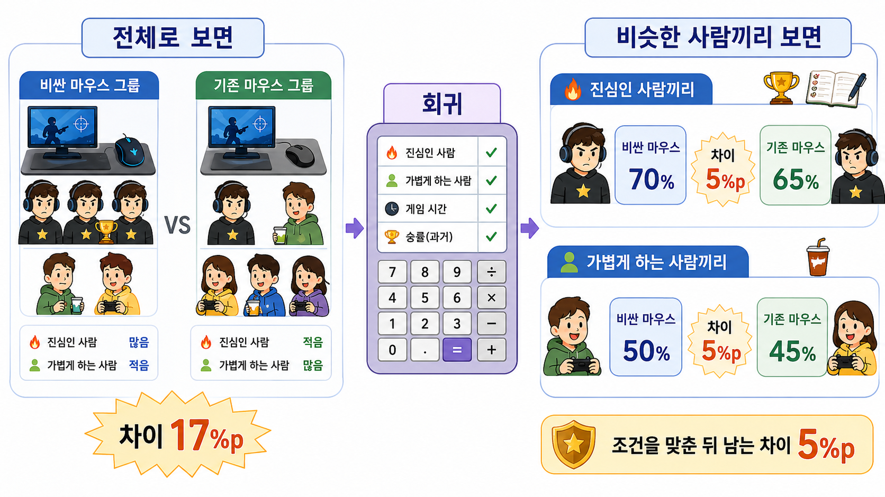

# 7장. 회귀를 조건부 비교로 읽기

## 17%p를 그대로 믿어도 될까?

장비 회사가 새 광고 문구를 만들려고 한다.

자료를 보니 비싼 마우스를 쓰는 사람의 승률이 더 높다.

전체 평균만 보면 차이는 꽤 크다.

```text
비싼 마우스 그룹 평균 = 66%
기존 마우스 그룹 평균 = 49%

차이 = 17%p
```

회의실에서는 바로 이런 말이 나온다.

> 새 마우스를 쓰면 승률이 17%p 오른다고 쓰면 되겠네.

하지만 우리는 이제 바로 믿지 않는다.

비싼 마우스 그룹에 원래 게임을 더 진심으로 하는 사람이 많을 수 있기 때문이다.

그러면 17%p 안에는 두 가지가 섞인다.

```text
마우스 차이
+ 게임에 진심인 정도 차이
```

회귀는 이 문제에서 출발한다.

> 마우스 말고 다른 차이를 최대한 맞춘 뒤에도, 차이가 남는가?

## 먼저 둘로 나눠 보자

아주 작은 예시로 보자.

플레이어를 두 종류로 나눌 수 있다고 하자.

- 게임에 진심인 사람
- 가볍게 하는 사람

이제 같은 종류 안에서만 마우스를 비교한다.

| 비교 | 비싼 마우스 | 기존 마우스 | 차이 |
| --- | ---: | ---: | ---: |
| 진심인 사람끼리 | 70% | 65% | 5%p |
| 가볍게 하는 사람끼리 | 50% | 45% | 5%p |

여기서 보이는 마우스 차이는 5%p다.

전체로 보면 17%p였는데, 비슷한 사람끼리 보면 5%p만 남는다.

왜 숫자가 이렇게 달라질까?

전체 비교에서는 진심인 사람이 비싼 마우스 쪽에 더 많이 섞여 있었다.

비슷한 사람끼리 나눠 보면 그 차이가 빠진다.

그래서 질문이 더 정확해진다.

> 게임에 진심인 정도가 비슷해도, 비싼 마우스 사용자의 승률이 더 높은가?

## 그림으로 보면 더 단순하다

아래 그림은 이 장에서 가장 중요한 장면이다.



왼쪽은 전체를 한꺼번에 비교한 장면이다.

비싼 마우스 그룹에는 진심인 사람이 많고, 기존 마우스 그룹에는 가볍게 하는 사람이 많다.

그래서 17%p는 마우스 차이만 보여주는 숫자가 아니다.

오른쪽은 사람을 비슷한 조건끼리 다시 나눈 장면이다.

진심인 사람끼리 비교해도 차이는 5%p다.

가볍게 하는 사람끼리 비교해도 차이는 5%p다.

이렇게 나누고 나면 `게임에 진심인 정도` 차이가 덜 섞인다.

그래서 5%p는 조건을 맞춘 뒤 남은 마우스 차이에 더 가깝다.

회귀는 두 번째 숫자에 가까운 답을 얻기 위해 쓴다.

## 회귀는 조건을 맞추는 계산표다

사람을 두 종류로만 나누면 손으로도 비교할 수 있다.

하지만 실제 자료는 더 복잡하다.

맞춰야 할 조건이 많아질 수 있다.

```text
게임에 진심인 정도
원래 승률
플레이 시간
포지션
게임 모드
팀원 수준
```

이걸 사람이 직접 나누면 금방 복잡해진다.

진심인 사람끼리 나눈다.

그 안에서 원래 승률이 비슷한 사람끼리 또 나눈다.

그 안에서 플레이 시간이 비슷한 사람끼리 또 나눈다.

이런 식으로 계속 나누면 비교할 사람이 너무 적어질 수도 있다.

회귀는 이 일을 계산으로 도와준다.

회귀를 처음에는 이렇게 생각하면 된다.

> 조건이 비슷한 사람끼리 비교하도록 정리해 주는 계산표.

## 계수는 어려운 말 같지만

회귀를 돌리면 `계수`라는 숫자가 나온다.

영어로는 `coefficient`다.

이 장에서는 계수를 이렇게 읽으면 충분하다.

> 다른 조건을 맞춘 뒤에도 남는 차이.

예를 들어 마우스 계수가 5라면 이렇게 읽는다.

```text
게임에 진심인 정도를 맞춰 봐도,
비싼 마우스 사용자는 평균적으로 승률이 5%p 더 높다.
```

중요한 것은 `5`라는 숫자 자체가 아니다.

무엇을 맞춘 뒤의 5인지가 중요하다.

그래서 회귀 결과를 볼 때는 항상 이렇게 물어야 한다.

> 이 숫자는 무엇을 맞춘 뒤에 나온 차이인가?

이 질문을 하지 않으면 회귀 계수도 그냥 또 하나의 위험한 평균 차이가 된다.

## 식은 마지막에 보면 된다

회귀식은 이렇게 생겼다.

```text
승률 = 기준 승률
     + 마우스 차이
     + 진심인 정도 차이
     + 설명하고도 남은 차이
```

조금 더 회귀식처럼 쓰면 이렇다.

```text
승률 = 기준 승률
     + 마우스 계수 × 비싼 마우스 사용
     + 진심 계수 × 진심인 사람
     + 남은 차이
```

여기서 `비싼 마우스 사용`은 비싼 마우스를 쓰면 1, 아니면 0이라고 표시한다.

`진심인 사람`도 진심인 사람이면 1, 아니면 0이라고 표시한다.

하지만 이 식을 외울 필요는 없다.

이 식이 하고 싶은 말은 앞에서 본 표와 같다.

> 마우스 차이와 진심인 정도 차이를 따로 보자.

## 직접 나눠 보면

아래 코드는 회귀를 직접 계산하지 않는다.

대신 회귀가 하려는 일을 손으로 보여준다.

전체 평균 차이를 먼저 보고, 그다음 비슷한 사람끼리 나눠서 차이를 다시 본다.

```python
players = []

def add_players(player_type, mouse, win_rate, count):
    for _ in range(count):
        players.append({
            "type": player_type,
            "mouse": mouse,
            "win_rate": win_rate,
        })

add_players("serious", "expensive", 70, 8)
add_players("casual", "expensive", 50, 2)
add_players("serious", "basic", 65, 2)
add_players("casual", "basic", 45, 8)

def average(rows):
    return sum(row["win_rate"] for row in rows) / len(rows)

expensive = [row for row in players if row["mouse"] == "expensive"]
basic = [row for row in players if row["mouse"] == "basic"]
overall_gap = average(expensive) - average(basic)

within_type_gaps = []
for player_type in ["serious", "casual"]:
    expensive_same_type = [
        row for row in players
        if row["type"] == player_type and row["mouse"] == "expensive"
    ]
    basic_same_type = [
        row for row in players
        if row["type"] == player_type and row["mouse"] == "basic"
    ]
    gap = average(expensive_same_type) - average(basic_same_type)
    within_type_gaps.append(gap)

adjusted_gap = sum(within_type_gaps) / len(within_type_gaps)

overall_gap, adjusted_gap
```

결과는 이렇게 읽는다.

```text
전체 평균 차이 = 17%p
비슷한 사람끼리 본 차이 = 5%p
```

코드가 보여주는 것은 하나다.

전체로 보면 장비 효과가 크게 보인다.

비슷한 사람끼리 보면 훨씬 작아진다.

회귀는 이런 비교를 조건이 더 많을 때도 해 보려는 방법이다.

## 회귀가 대신 정해 주지는 않는다

회귀는 계산을 도와준다.

하지만 무엇을 맞춰야 하는지는 대신 정해 주지 않는다.

`게임에 진심인 정도`를 맞춰야 한다고 판단하는 일은 회귀가 아니라 우리가 해야 한다.

반대로 맞추면 안 되는 것도 있다.

예를 들어 마우스를 바꾼 뒤 생긴 손목 피로를 억지로 맞추면, 마우스가 승률을 올리는 과정 일부를 지워 버릴 수 있다.

그래서 회귀를 쓰기 전에 먼저 물어야 한다.

```text
이 변수는 비교 전에 이미 달랐던 조건인가?
이 변수는 처치 뒤에 생긴 변화인가?
이 변수로 사람을 고르고 있지는 않은가?
```

회귀는 이 질문의 답을 모르고 계산한다.

그래서 좋은 회귀는 좋은 그래프 질문 뒤에 온다.

## 여기서 다음 질문이 생긴다

이번 장에서는 회귀를 조건부 비교로 읽었다.

아직은 `진심인 사람`, `가볍게 하는 사람`처럼 말로 된 집단을 그냥 표에 적었다.

하지만 회귀는 이런 집단 이름도 숫자로 바꿔야 계산할 수 있다.

다음 장에서는 이 문제를 본다.

> 더미 변수는 어떻게 집단 이름을 0과 1로 바꿔서 비교하게 해 줄까?

## 한 줄 요약

회귀는 어려운 수식부터 시작하는 도구가 아니라, 전체 평균에 섞인 차이를 줄이기 위해 비슷한 조건끼리 비교하도록 도와주는 계산 방법이다.
