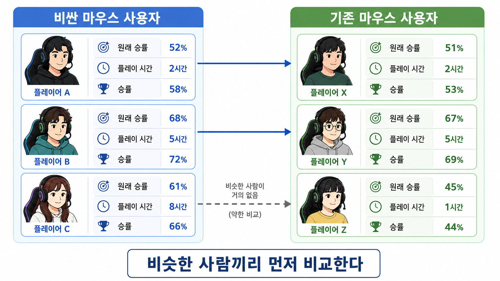

# 12장. 관측 자료에서 비교 대상을 찾는다는 것

## 실험을 못 하면 누구와 비교할까

장비 회사가 이번에는 실험을 못 했다고 하자.

비싼 마우스를 사람들에게 운으로 나눠 준 것이 아니다.

대신 이미 쌓여 있는 기록만 있다.

쇼핑몰 구매 기록과 게임 로그를 보는 것이다.

```text
누가 비싼 마우스를 샀는가
그 사람의 원래 승률은 어땠는가
하루에 몇 시간 플레이했는가
게임에 얼마나 진심인가
마우스를 바꾼 뒤 승률은 어땠는가
```

회의실에서 누군가 말한다.

> 비싼 마우스를 산 사람과 안 산 사람을 비슷한 사람끼리 비교하면 되지 않을까?

이 말은 꽤 그럴듯하다.

무작위 실험을 못 한다면, 적어도 비슷한 사람끼리 비교하고 싶다.

하지만 여기서 바로 조심해야 한다.

비슷하다는 말은 생각보다 까다롭다.

원래 승률이 비슷한가?

플레이 시간이 비슷한가?

게임 모드가 비슷한가?

진심인 정도도 비슷한가?

비슷한 사람을 찾는 일은 단순한 정리가 아니라, 실험이 없을 때 비교 대상을 만드는 일이다.

## 그냥 평균을 보면 다시 속는다

먼저 쉬운 비교부터 해 보자.

| 그룹 | 바꾼 뒤 평균 승률 |
| --- | ---: |
| 비싼 마우스 사용자 | 68% |
| 기존 마우스 사용자 | 51% |

평균 차이는 17%p다.

```text
68 - 51 = 17
```

이 숫자만 보면 장비빨이 엄청나 보인다.

하지만 앞 장들을 읽었다면 이제 바로 의심해야 한다.

비싼 마우스 사용자는 원래부터 더 잘했을 수 있다.

게임을 더 오래 했을 수 있다.

비싼 장비를 살 만큼 게임에 더 진심이었을 수도 있다.

그러면 17%p는 마우스 효과만이 아니다.

원래 있던 차이도 같이 들어 있다.

## 짝을 찾아 보면 숫자가 달라진다

이번에는 비싼 마우스를 산 사람마다, 비슷한 기존 마우스 사용자를 찾아 보자.

| 비싼 마우스 사용자 | 원래 승률 | 플레이 시간 | 비슷한 기존 사용자 | 원래 승률 | 플레이 시간 |
| --- | ---: | ---: | --- | ---: | ---: |
| A | 62% | 3.0시간 | E | 61% | 3.1시간 |
| B | 58% | 2.5시간 | F | 57% | 2.4시간 |
| C | 70% | 4.0시간 | G | 69% | 4.2시간 |
| D | 50% | 1.5시간 | H | 51% | 1.4시간 |



위쪽 두 짝은 원래 승률과 플레이 시간이 비슷해서 비교가 비교적 자연스럽다.

아래쪽 점선 짝은 비슷한 기존 사용자가 거의 없어서 억지로 만든 비교에 가깝다.

매칭은 아무나 붙이는 일이 아니라, 비교해도 될 만큼 비슷한 사람을 찾는 일이다.

이제 비교는 이렇게 바뀐다.

| 짝 | 비싼 마우스 사용자 승률 | 비슷한 기존 사용자 승률 | 차이 |
| --- | ---: | ---: | ---: |
| A - E | 69% | 64% | 5%p |
| B - F | 63% | 59% | 4%p |
| C - G | 75% | 70% | 5%p |
| D - H | 55% | 51% | 4%p |

짝 안에서 평균 차이는 4.5%p다.

처음 평균 차이 17%p보다 훨씬 작다.

이 차이가 줄어든 이유는 마우스 효과가 사라져서가 아니다.

처음 비교에 섞여 있던 원래 실력 차이를 조금 덜어 냈기 때문이다.

## 비슷한 사람을 짝으로 붙인다

이렇게 비슷한 사람끼리 짝을 맞춰 비교하는 방법을 **매칭**이라고 부른다.

영어로는 `matching`이다.

매칭의 생각은 단순하다.

```text
처치를 받은 사람에게
처치를 받지 않았지만 최대한 비슷한 사람을 붙인다.
```

여기서 처치는 비싼 마우스 사용이다.

결과는 승률이다.

비싼 마우스를 산 A에게 기존 마우스를 쓰는 E를 붙이는 이유는 하나다.

A가 마우스를 사지 않았다면 E와 비슷했을 것이라고 보기 위해서다.

물론 E가 A의 진짜 반사실은 아니다.

A가 마우스를 사지 않은 세계를 직접 본 것은 아니다.

하지만 원래 승률과 플레이 시간이 비슷하다면, E는 A의 비교 대상으로 조금 더 믿을 만하다.

## 비교는 짝 안에서 한다

매칭으로 효과를 읽을 때는 전체 평균부터 보지 않는다.

먼저 각 짝 안에서 차이를 본다.

```text
A의 차이 = A의 승률 - A와 비슷한 기존 사용자의 승률
B의 차이 = B의 승률 - B와 비슷한 기존 사용자의 승률
C의 차이 = C의 승률 - C와 비슷한 기존 사용자의 승률
```

그다음 이 차이들을 평균낸다.

```text
매칭으로 본 효과 = 짝 안 차이들의 평균
```

기호로 쓰면 이렇게 읽을 수 있다.

```text
효과 = 평균(처치받은 사람의 결과 - 그 사람과 비슷한 비교 대상의 결과)
```

조금 더 짧게 쓰면 이렇다.

```text
effect_i = Y_i - Y_match(i)
```

`Y_i`는 i번째 사람의 결과다.

`Y_match(i)`는 i번째 사람과 짝이 된 비교 대상의 결과다.

중요한 것은 기호가 아니다.

중요한 것은 비교 단위가 바뀌었다는 점이다.

전체 평균끼리 바로 빼는 것이 아니라, 비슷한 사람끼리 먼저 빼고 그 차이를 모은다.

## 가까운 사람을 어떻게 정할까

조건이 하나라면 쉽다.

원래 승률이 같은 사람을 찾으면 된다.

하지만 조건이 여러 개면 더 어려워진다.

```text
원래 승률
플레이 시간
게임에 진심인 정도
포지션
게임 모드
```

이제 우리는 “가깝다”는 말을 숫자로 정해야 한다.

예를 들어 A와 E가 이렇게 다르다고 하자.

```text
원래 승률 차이 = 1%p
플레이 시간 차이 = 0.1시간
```

A와 K는 이렇게 다르다.

```text
원래 승률 차이 = 8%p
플레이 시간 차이 = 2.0시간
```

그러면 E가 A에게 더 가까운 비교 대상이다.

실제 자료에서는 이런 차이를 여러 조건에 대해 계산하고, 가장 가까운 사람을 찾는다.

이 생각을 **가장 가까운 이웃**이라고 부르기도 한다.

영어로는 `nearest neighbor`다.

말은 낯설지만 하는 일은 단순하다.

> 나와 가장 비슷한 반대쪽 사람을 찾는다.

## 단위가 다르면 가까움도 이상해진다

가까운 사람을 찾을 때 조심할 점이 있다.

조건마다 단위가 다르다.

```text
원래 승률: 0부터 100까지
플레이 시간: 0부터 10시간 정도
마우스 가격: 몇 만 원부터 몇십만 원
```

그냥 숫자 차이를 더하면 큰 단위를 가진 조건이 비교에 너무 크게 반영된다.

마우스 가격 차이 50,000원은 원래 승률 차이 5%p보다 숫자로 훨씬 커 보인다.

하지만 그것만으로 가격이 더 중요한 조건이라고 말할 수는 없다.

그래서 매칭을 할 때는 조건들의 단위를 맞춰야 한다.

어떤 조건 하나가 숫자 크기 때문에 비교를 지배하지 않게 만드는 것이다.

이 작업을 어려운 말로는 표준화라고 부르지만, 지금은 이렇게 이해하면 된다.

> 서로 다른 자로 잰 숫자들을 비교 가능한 크기로 맞춘다.

## 손으로 짝을 맞춰 보면

아래 코드는 네 명의 비싼 마우스 사용자에게 가장 비슷한 기존 마우스 사용자를 붙인다.

여기서는 누가 누구와 짝이 되는지가 중요하므로, 계산 순서를 직접 따라가면 이해가 쉽다.

`hours`는 시간 단위라서 숫자가 작게 보인다.

그래서 아래 코드에서는 시간 차이에 10을 곱해 승률 차이와 비슷한 크기로 맞춘다.

```python
treated = [
    {"name": "A", "base": 62, "hours": 3.0, "win": 69},
    {"name": "B", "base": 58, "hours": 2.5, "win": 63},
    {"name": "C", "base": 70, "hours": 4.0, "win": 75},
    {"name": "D", "base": 50, "hours": 1.5, "win": 55},
]

untreated = [
    {"name": "E", "base": 61, "hours": 3.1, "win": 64},
    {"name": "F", "base": 57, "hours": 2.4, "win": 59},
    {"name": "G", "base": 69, "hours": 4.2, "win": 70},
    {"name": "H", "base": 51, "hours": 1.4, "win": 51},
    {"name": "K", "base": 42, "hours": 0.8, "win": 43},
]


def distance(left, right):
    base_gap = left["base"] - right["base"]
    hour_gap = (left["hours"] - right["hours"]) * 10
    return base_gap ** 2 + hour_gap ** 2


matched_diffs = []

for player in treated:
    match = min(untreated, key=lambda other: distance(player, other))
    diff = player["win"] - match["win"]
    matched_diffs.append(diff)
    print(player["name"], "->", match["name"], diff)

sum(matched_diffs) / len(matched_diffs)
```

결과는 이런 식으로 읽는다.

```text
A -> E 5
B -> F 4
C -> G 5
D -> H 4

짝 안 평균 차이 = 4.5
```

처음 전체 평균 차이 17%p와 비교하면 결론이 많이 달라진다.

## 비슷한 사람이 없으면 약해진다

매칭은 직관적이다.

하지만 마법은 아니다.

첫 번째 문제는 정말 비슷한 사람이 없을 수 있다는 점이다.

예를 들어 비싼 마우스를 쓰는 사람이 이런 사람이라고 하자.

```text
원래 승률 82%
하루 플레이 7시간
랭커
특정 포지션만 플레이
```

기존 마우스 사용자 중에 이런 사람이 거의 없다면 어떻게 될까?

겉으로 가장 가까운 사람을 붙일 수는 있다.

하지만 그 짝은 실제로는 별로 비슷하지 않을 수 있다.

그러면 매칭으로 만든 차이에도 편향이 남는다.

여기서 편향은 “짝이 충분히 비슷하지 않아서 생기는 차이”라고 보면 된다.

## 조건이 많아질수록 짝을 찾기 어렵다

두 번째 문제는 조건이 많아질수록 더 심해진다.

원래 승률만 비슷한 사람은 찾기 쉽다.

원래 승률과 플레이 시간이 둘 다 비슷한 사람도 어느 정도 찾을 수 있다.

그런데 조건이 계속 늘어나면 어떨까?

```text
원래 승률이 비슷하고
플레이 시간이 비슷하고
게임 모드가 비슷하고
포지션이 비슷하고
팀원 수준이 비슷하고
사는 지역과 접속 시간대도 비슷한 사람
```

이런 사람은 찾기 어려워진다.

조건을 많이 볼수록 “정말 비슷한 사람”은 줄어든다.

이 문제를 **차원의 저주**라고 부른다.

영어로는 `curse of dimensionality`다.

이름은 낯설지만 뜻은 간단하다.

> 조건이 많아질수록, 같은 조건을 가진 비교 대상을 찾기 어려워진다.

그래서 매칭은 “비슷한 사람끼리 비교한다”는 좋은 생각을 갖고 있지만, 자료가 충분하지 않으면 오히려 불안해진다.

## 보이지 않는 차이는 여전히 남는다

매칭의 세 번째 한계는 더 중요하다.

매칭은 우리가 관측한 조건으로만 사람을 맞춘다.

원래 승률, 플레이 시간, 게임 모드는 자료에 있을 수 있다.

하지만 이런 것은 없을 수 있다.

```text
손 감각
팀원과의 호흡
긴장하는 정도
실전 판단력
장비 세팅을 제대로 하는 능력
```

이런 차이가 마우스 선택과 승률을 둘 다 움직인다면, 매칭을 해도 문제가 남는다.

비슷하게 보이는 두 사람이 실제로는 중요한 점에서 다를 수 있기 때문이다.

그래서 매칭 결과를 볼 때는 항상 물어야 한다.

> 무엇을 기준으로 비슷하다고 했는가?

그리고 바로 이어서 물어야 한다.

> 그 기준에 빠진 중요한 차이는 없는가?

## 좋은 짝은 좋은 질문에서 나온다

매칭은 회귀와 다르게 보인다.

회귀는 결과표의 계수를 읽는다.

매칭은 사람마다 짝을 찾는다.

하지만 둘의 핵심 질문은 이어져 있다.

```text
처치 말고 다른 조건이 비슷한 사람끼리 비교하고 있는가?
```

회귀는 이 질문을 계산식으로 처리한다.

매칭은 이 질문을 짝짓기로 처리한다.

둘 다 좋은 통제와 나쁜 통제를 구분하는 판단이 먼저 필요하다.

맞추면 안 되는 변수를 기준으로 짝을 찾으면 매칭도 잘못된다.

예를 들어 마우스를 바꾼 뒤 생긴 손목 피로를 기준으로 사람을 맞추면, 마우스가 승률을 올리는 과정 일부를 지워 버릴 수 있다.

그래서 매칭은 “기계적으로 비슷한 사람을 찾는 버튼”이 아니다.

어떤 변수를 기준으로 비슷해야 하는지 먼저 정해야 한다.

## 양쪽 사람이 모두 있어야 비교할 수 있다

매칭이 잘 되려면 양쪽 사람이 실제로 모두 있어야 한다.

비싼 마우스를 쓰는 고수만 있고, 비슷한 기존 마우스 고수가 없다면 비교가 어렵다.

반대로 기존 마우스를 쓰는 초보만 있고, 비슷한 비싼 마우스 초보가 없다면 그것도 어렵다.

즉 관측 자료 안에 이런 겹침이 필요하다.

```text
비슷한 조건의 비싼 마우스 사용자
비슷한 조건의 기존 마우스 사용자
```

이 겹침이 없으면 매칭은 억지로 먼 사람을 붙이게 된다.

그런 비교는 공정해 보이지만 실제로는 약하다.

그래서 매칭을 하기 전에 자료를 먼저 봐야 한다.

> 비교하려는 조건 안에 양쪽 사람이 모두 있는가?

이 질문은 다음 장의 핵심으로 이어진다.

## 사람을 직접 찾기 어려울 때

조건이 몇 개 없으면 비슷한 사람을 직접 찾을 수 있다.

하지만 조건이 많아지면 짝을 직접 찾기 어렵다.

그렇다고 모든 조건을 다 포기할 수도 없다.

그래서 다음 장에서는 다른 생각을 쓴다.

사람을 여러 조건으로 하나하나 맞추는 대신, “처치를 받을 가능성” 하나로 요약해 본다.

비싼 마우스를 살 가능성이 비슷한 사람끼리 비교하면 어떨까?

이 생각이 성향 점수다.

영어로는 `propensity score`다.

> 여러 조건을 하나의 가능성 점수로 줄이면 비교가 쉬워질까?

## 한 줄 요약

매칭은 실험이 없을 때 관측된 조건이 비슷한 사람끼리 짝을 맞춰 비교하는 방법이지만, 좋은 짝이 실제로 있어야 하고 보이지 않는 차이까지 없애 주지는 못한다.
