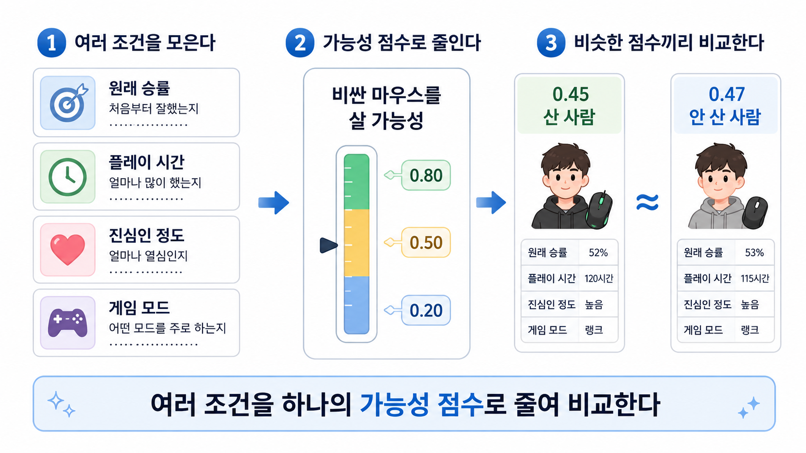

# 13장. 처치받을 가능성으로 균형 맞추기

## 12장의 매칭을 더 단순하게 만들면

장비 회사 회의실에서 누군가 보고서를 띄운다.

```text
비싼 마우스를 산 유저 평균 승률: 68%
비싼 마우스를 안 산 유저 평균 승률: 52%
```

바로 이런 말이 나올 수 있다.

> 이 정도면 장비 효과가 확실한 것 아닌가요?

그냥 산 사람과 안 산 사람을 비교하면 위험하다.

비싼 마우스를 산 사람은 원래부터 더 잘했을 수 있고, 더 오래 했을 수 있고, 게임에 더 진심이었을 수 있다.

그래서 비교할 때는 이런 차이를 줄여야 한다.

12장의 매칭은 이 일을 직접 했다.

```text
원래 승률이 비슷한가?
플레이 시간도 비슷한가?
게임 모드도 비슷한가?
```

문제는 조건이 많아질수록 사람을 직접 찾기 어렵다는 점이다.

그래서 회의실에서 질문을 바꾼다.

```text
이 사람은 원래 비싼 마우스를 살 가능성이 얼마나 높았는가?
```

이 숫자가 **성향 점수**다.

영어로는 `propensity score`다.

이 장에서 처치는 비싼 마우스를 사는 일이다.

그래서 여기서는 이렇게 읽으면 된다.

```text
성향 점수 = 비싼 마우스를 살 가능성
```

## 여러 조건을 가능성 하나로 요약한다

아래 그림은 이 장의 핵심 흐름이다.



먼저 여러 조건을 모은다.

```text
원래 승률
플레이 시간
진심인 정도
게임 모드
```

그다음 이 조건들을 사용해 숫자 하나를 만든다.

```text
비싼 마우스를 살 가능성
```

마지막으로 그 숫자가 비슷한 사람끼리 비교한다.

그림 오른쪽을 보자.

한 사람은 성향 점수가 0.45이고 실제로 비싼 마우스를 샀다.

다른 사람은 성향 점수가 0.47이고 실제로 사지 않았다.

둘 다 0.5 근처다.

즉 둘 다 살 수도 있고 안 살 수도 있는 중간쯤의 유저다.

여기서 비교할 것은 성향 점수가 아니다.

마지막에 볼 것은 승률이다.

```text
0.5 근처 유저들 안에서
실제로 산 사람의 승률이 더 높은가?
```

이 질문이 성향 점수를 쓰는 이유다.

성향 점수는 승률 점수가 아니다.

마우스를 쓰면 얼마나 잘할지를 말하지 않는다.

그 사람이 비싼 마우스를 살 가능성이 얼마나 높았는지를 말한다.

예를 들어 이런 자료가 있다고 하자.

| 플레이어 | 원래 승률 | 플레이 시간 | 진심인 정도 | 실제 선택 | 성향 점수 |
| --- | ---: | ---: | --- | --- | ---: |
| A | 70% | 4.0시간 | 높음 | 삼 | 0.85 |
| B | 68% | 3.8시간 | 높음 | 안 삼 | 0.82 |
| C | 55% | 2.0시간 | 보통 | 삼 | 0.45 |
| D | 53% | 2.1시간 | 보통 | 안 삼 | 0.47 |
| E | 42% | 0.8시간 | 낮음 | 안 삼 | 0.12 |
| F | 40% | 0.7시간 | 낮음 | 삼 | 0.10 |

0.85는 이렇게 읽는다.

```text
이 조건을 가진 사람은 비싼 마우스를 살 가능성이 약 85%다.
```

A와 F를 바로 비교하면 어렵다.

A는 비싼 마우스를 살 가능성이 0.85이고, F는 0.10이다.

두 사람은 애초에 다른 쪽에 있는 사람이다.

반대로 C와 D는 성향 점수가 비슷하다.

C는 0.45이고, D는 0.47이다.

조건이 완전히 같다는 뜻은 아니다.

하지만 둘 다 비싼 마우스를 살 가능성은 비슷했다.

이 표에서 그림 오른쪽과 같은 비교는 C와 D다.

C는 실제로 샀고, D는 실제로 사지 않았다.

C와 D의 성향 점수는 둘 다 0.5 근처다.

회의실에서는 이 둘을 보며 이렇게 묻는다.

```text
둘 다 살 가능성이 중간쯤이었는데,
실제로 산 쪽의 승률이 더 높았는가?
```

## 개인보다 구간으로 보는 편이 쉽다

성향 점수를 처음 볼 때는 개인끼리 완벽하게 비슷하다고 생각하면 헷갈린다.

더 쉬운 방법은 그림의 0.5를 기준으로 근처 구간을 보는 것이다.

```text
성향 점수 0.40 ~ 0.60인 사람들
```

이 구간 안에는 실제로 비싼 마우스를 산 사람도 있고, 사지 않은 사람도 있을 수 있다.

그럼 그 안에서 두 집단의 승률을 비교한다.

| 성향 점수 구간 | 실제 선택 | 평균 승률 |
| --- | --- | ---: |
| 0.40 ~ 0.60 | 비싼 마우스 삼 | 61% |
| 0.40 ~ 0.60 | 비싼 마우스 안 삼 | 57% |

이 구간에서는 차이가 4%p다.

```text
61 - 57 = 4
```

다른 구간도 같은 방식으로 본다.

| 성향 점수 구간 | 실제 선택 | 평균 승률 | 차이 |
| --- | --- | ---: | ---: |
| 0.20 ~ 0.30 | 삼 / 안 삼 | 50% / 49% | 1%p |
| 0.40 ~ 0.60 | 삼 / 안 삼 | 61% / 57% | 4%p |
| 0.80 ~ 0.90 | 삼 / 안 삼 | 72% / 69% | 3%p |

이 차이들을 모으면 비싼 마우스 효과를 추정할 수 있다.

즉 성향 점수는 개인을 완벽하게 짝짓는 방법만은 아니다.

비슷한 점수 구간 안에서 산 집단과 안 산 집단을 비교하는 방법으로도 쓸 수 있다.

## 개인끼리 짝을 붙일 수도 있다

구간으로 나누는 대신, 성향 점수가 비슷한 사람끼리 1:1로 붙일 수도 있다.

| 비싼 마우스 사용자 | 성향 점수 | 기존 마우스 사용자 | 성향 점수 |
| --- | ---: | --- | ---: |
| C | 0.45 | D | 0.47 |
| G | 0.62 | H | 0.60 |
| I | 0.28 | J | 0.30 |

이것을 성향 점수 매칭이라고 부를 수 있다.

12장의 매칭과 다른 점은 기준이다.

```text
12장 매칭: 조건 여러 개를 직접 비교한다.
성향 점수 매칭: 조건 여러 개로 만든 확률 하나를 비교한다.
```

성향 점수는 보통 이렇게 쓴다.

```text
e(x) = P(T = 1 | X = x)
```

뜻은 방금 본 것과 같다.

`T = 1`은 처치를 받았다는 뜻이다.

여기서는 비싼 마우스를 샀다는 뜻이다.

`X = x`는 그 사람의 조건을 본다는 뜻이다.

즉 `e(x)`는 그 조건을 가진 사람이 비싼 마우스를 살 가능성이다.

## 그래도 모든 사람을 짝짓기는 어렵다

성향 점수로 짝을 찾는 것도 한계가 있다.

어떤 사람은 비슷한 점수를 가진 반대쪽 사람이 없을 수 있다.

또 어떤 사람은 짝을 찾긴 했지만, 그 짝이 아주 좋지는 않을 수 있다.

그래서 성향 점수를 쓰는 또 다른 방법이 있다.

사람을 버리거나 억지로 짝짓기보다, 평균을 낼 때 사람마다 크기를 다르게 보는 방법이다.

이때 나오는 말이 **가중치**다.

가중치는 어떤 사람의 자료를 평균에서 얼마나 크게 볼지 정하는 숫자다.

## 드문 선택을 한 사람을 더 크게 본다

왜 사람마다 크기를 다르게 볼까?

예를 들어 이런 사람이 있다고 하자.

```text
비싼 마우스를 살 가능성은 0.10이다.
그런데 실제로는 비싼 마우스를 샀다.
```

이 사람은 흔하지 않다.

대부분은 이런 조건이면 비싼 마우스를 사지 않았을 것이다.

그런데 이 사람은 샀다.

그래서 비교에 도움이 된다.

비싼 마우스를 잘 안 살 것 같은 사람 중에서, 실제로 비싼 마우스를 쓴 사례이기 때문이다.

반대로 이런 사람도 중요하다.

```text
비싼 마우스를 살 가능성은 0.90이다.
그런데 실제로는 사지 않았다.
```

이 사람도 흔하지 않다.

비싼 마우스를 살 것 같은 사람 중에서, 실제로 사지 않은 비교 대상이기 때문이다.

성향 점수 가중치는 이런 드문 선택을 한 사람을 더 크게 본다.

## 역수는 드문 정도를 크게 만든다

이제 가중치를 계산해 보자.

비싼 마우스를 산 사람의 성향 점수가 `e`라면 가중치는 이렇게 둔다.

```text
1 / e
```

예를 들어 비싼 마우스를 살 가능성이 0.10인데 실제로 샀다면, 가중치는 10이다.

```text
1 / 0.10 = 10
```

가능성이 낮은 일이 실제로 일어났으니 크게 보는 것이다.

반대로 기존 마우스를 쓴 사람은 “비싼 마우스를 사지 않을 가능성”을 본다.

성향 점수가 0.90이라면, 비싼 마우스를 사지 않을 가능성은 0.10이다.

```text
1 - 0.90 = 0.10
```

그런데 실제로 사지 않았다면 이것도 드문 일이다.

그래서 가중치는 이렇게 된다.

```text
1 / (1 - 0.90) = 10
```

이 방법을 **처치 확률의 역수 가중치**라고 부른다.

영어로는 `inverse probability of treatment weighting`이다.

보통 줄여서 `IPTW`라고 쓴다.

이름은 길지만 뜻은 이것이다.

> 원래 그 선택을 할 가능성이 낮았던 사람을 평균에서 더 크게 본다.

## 작은 표로 다시 평균을 낸다

아래 표를 보자.

| 플레이어 | 비싼 마우스 사용 | 성향 점수 | 승률 |
| --- | ---: | ---: | ---: |
| A | 1 | 0.80 | 72% |
| B | 1 | 0.60 | 66% |
| C | 1 | 0.20 | 58% |
| D | 0 | 0.75 | 67% |
| E | 0 | 0.40 | 55% |
| F | 0 | 0.15 | 47% |

그냥 평균을 비교하면 이렇게 된다.

```text
비싼 마우스 사용자 평균 = 65.3%
기존 마우스 사용자 평균 = 56.3%
차이 = 9.0%p
```

하지만 이 비교에는 원래 차이가 섞여 있을 수 있다.

그래서 성향 점수 가중치를 써서 다시 평균을 내 본다.

C는 성향 점수가 0.20인데 실제로 비싼 마우스를 썼다.

비싼 마우스를 잘 안 살 것 같은 사람 중에서 실제로 산 사례다.

D는 성향 점수가 0.75인데 실제로 기존 마우스를 썼다.

비싼 마우스를 살 것 같은 사람 중에서 실제로 안 산 비교 대상이다.

이 두 사람은 평균에서 더 크게 볼 만하다.

이렇게 다시 평균을 내는 이유도 같다.

비싼 마우스 사용자와 기존 마우스 사용자가 더 비슷한 조건에서 비교되도록 평균을 다시 만드는 것이다.

그렇게 만든 두 평균의 차이를 보고 마우스가 승률을 얼마나 올렸는지 추정한다.

## 숫자로 확인한다

아래 코드는 방금 표에서 가중 평균을 계산한다.

가중치는 눈으로만 보면 헷갈리기 쉬우므로, 어떤 사람이 더 크게 반영되는지 계산 순서를 따라가 본다.

```python
players = [
    {"name": "A", "treated": 1, "score": 0.80, "win": 72},
    {"name": "B", "treated": 1, "score": 0.60, "win": 66},
    {"name": "C", "treated": 1, "score": 0.20, "win": 58},
    {"name": "D", "treated": 0, "score": 0.75, "win": 67},
    {"name": "E", "treated": 0, "score": 0.40, "win": 55},
    {"name": "F", "treated": 0, "score": 0.15, "win": 47},
]


def average(rows):
    return sum(row["win"] for row in rows) / len(rows)


def weighted_average(rows):
    total_weight = sum(row["weight"] for row in rows)
    return sum(row["win"] * row["weight"] for row in rows) / total_weight


for row in players:
    if row["treated"]:
        row["weight"] = 1 / row["score"]
    else:
        row["weight"] = 1 / (1 - row["score"])

treated = [row for row in players if row["treated"]]
untreated = [row for row in players if not row["treated"]]

plain_gap = average(treated) - average(untreated)
weighted_gap = weighted_average(treated) - weighted_average(untreated)

print(round(plain_gap, 2), round(weighted_gap, 2))
```

결과는 이렇게 읽으면 된다.

```text
그냥 평균 차이 = 9.0
가중 평균 차이 = 1.26
```

숫자가 줄었다고 해서 무조건 1.26%p가 정답이라는 뜻은 아니다.

핵심은 효과를 읽는 평균이 바뀌었다는 점이다.

그냥 평균 차이는 원래 실력 차이가 섞인 비교일 수 있다.

가중 평균 차이는 그 차이를 줄이려고 다시 만든 비교다.

그래서 이 예시에서는 “조건을 맞춰 보니 비싼 마우스 효과는 9%p보다 훨씬 작아 보인다” 정도로 읽는 것이 더 자연스럽다.

## 점수는 직접 추정해야 한다

성향 점수는 보통 실제로 알고 있는 값이 아니다.

자료로 추정해야 한다.

예를 들어 이런 정보를 넣어 “비싼 마우스를 살 가능성”을 맞혀 본다.

```text
원래 승률
플레이 시간
진심인 정도
장비 구매 이력
게임 모드
```

이때 로지스틱 회귀 같은 모델을 쓸 수 있다.

다른 예측 모델을 쓸 수도 있다.

하지만 모델이 틀리면 성향 점수도 틀린다.

성향 점수가 틀리면 짝짓기나 가중치도 틀린다.

그래서 성향 점수는 계산하면 끝나는 정답이 아니다.

어떤 조건으로 처치 가능성을 추정했는지 설명할 수 있어야 한다.

## 점수가 너무 끝에 몰리면 위험하다

성향 점수 가중치에는 큰 약점이 있다.

점수가 0이나 1에 너무 가까우면 가중치가 커진다.

예를 들어 비싼 마우스를 살 가능성이 0.01인 사람이 실제로 비싼 마우스를 샀다고 하자.

가중치는 100이다.

```text
1 / 0.01 = 100
```

한 사람이 평균을 너무 크게 흔들 수 있다.

반대로 비싼 마우스를 살 가능성이 0.99인 사람이 실제로 사지 않아도 가중치는 100이다.

이런 자료는 분석을 불안정하게 만든다.

그래서 성향 점수를 볼 때는 0이나 1에 너무 가까운 사람이 많은지 확인해야 한다.

## 비교할 양쪽이 모두 있어야 한다

비교가 되려면 양쪽 사람이 모두 있어야 한다.

비싼 마우스를 살 가능성이 0.95인 사람 중에 전부 비싼 마우스를 샀다면 어떨까?

그 구간에는 기존 마우스 사용자가 없다.

그러면 비교할 대상이 없다.

반대로 가능성이 0.05인 사람 중에 전부 기존 마우스를 썼다면, 그 구간에는 비싼 마우스 사용자가 없다.

이런 경우 성향 점수를 써도 비교가 어렵다.

이 조건을 **positivity**라고 부른다.

한국어로는 “비교할 양쪽이 모두 있어야 한다” 정도로 이해하면 된다.

> 비슷한 가능성의 사람들 안에 처치를 받은 사람도 있고, 받지 않은 사람도 있어야 한다.

## 보이지 않는 차이는 여전히 남는다

성향 점수는 자료에 있는 조건으로 만든다.

자료에 없는 차이는 점수에 들어가지 않는다.

예를 들어 장비 세팅을 얼마나 잘하는지 자료에 없다고 하자.

그런데 이 능력이 비싼 마우스 구매와 승률을 둘 다 움직인다면 문제가 남는다.

성향 점수는 그 차이를 맞추지 못한다.

그래서 성향 점수는 숨은 이유를 자동으로 없애는 도구가 아니다.

관측한 조건을 이용해 비교를 더 공정하게 만들려는 방법이다.

## 같은 질문을 다른 방식으로 묻는다

매칭은 비슷한 사람을 직접 찾는다.

성향 점수는 비슷한 가능성을 가진 사람을 찾거나, 그 가능성으로 가중치를 준다.

모양은 다르지만 질문은 같다.

```text
처치를 받은 사람과 받지 않은 사람이 비교 가능하도록 만들 수 있는가?
```

왜 이 질문이 중요할까?

그래야 마지막에 승률 차이를 마우스 효과로 읽을 수 있기 때문이다.

성향 점수는 이 질문에 이렇게 답한다.

```text
처치를 받을 가능성이 비슷한 사람끼리 비교해 보자.
또는 드문 선택을 한 사람에게 더 큰 가중치를 주자.
```

그래서 성향 점수는 회귀나 매칭을 완전히 대신하는 방법이 아니다.

관측 자료에서 비교를 만드는 또 하나의 방법이다.

## 하나의 모델만 믿어도 될까

여기까지 오면 새로운 걱정이 생긴다.

성향 점수는 처치를 받을 가능성 모델에 크게 기대고 있다.

그 모델이 틀리면 결과도 흔들릴 수 있다.

그렇다면 다른 보완 방법을 함께 쓸 수 있을까?

예를 들어 결과를 예측하는 모델도 같이 쓰면 어떨까?

처치 가능성 모델과 결과 모델 중 하나라도 괜찮으면 추정이 크게 무너지지 않게 만들 수 있을까?

다음 장에서는 이 생각을 본다.

> 두 모델을 함께 쓰면 무엇이 더 안전해질까?

## 한 줄 요약

성향 점수는 여러 조건을 “처치를 받을 가능성” 하나로 요약해 비교를 맞추려는 방법이며, 점수가 틀리거나 비교할 양쪽 사람이 없거나 보이지 않는 차이가 있으면 여전히 위험하다.
