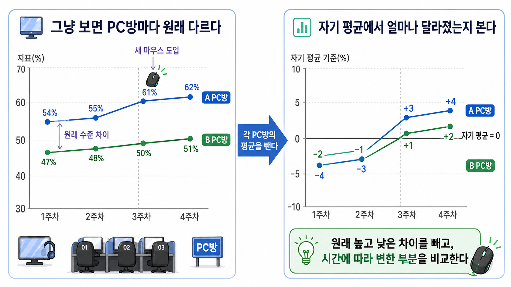

# 16장. 같은 PC방을 여러 번 보면 무엇을 뺄 수 있을까

## PC방마다 원래 다르다

15장에서는 일부 PC방에만 새 마우스를 설치했다.

그리고 설치 전후 변화를 비교했다.

이번에는 자료가 더 길다고 하자.

한 번의 설치 전, 설치 후만 있는 것이 아니다.

여러 주 동안 PC방별 평균 승률을 기록했다.

회의실에 이런 표가 올라온다.

| PC방 | 주차 | 새 마우스 설치 | 평균 승률 |
| --- | ---: | --- | ---: |
| A PC방 | 1주차 | 아니오 | 54% |
| A PC방 | 2주차 | 아니오 | 55% |
| A PC방 | 3주차 | 예 | 61% |
| A PC방 | 4주차 | 예 | 62% |
| B PC방 | 1주차 | 아니오 | 47% |
| B PC방 | 2주차 | 아니오 | 48% |
| B PC방 | 3주차 | 아니오 | 50% |
| B PC방 | 4주차 | 아니오 | 51% |

A PC방은 전반적으로 승률이 높다.

B PC방은 전반적으로 승률이 낮다.

이 차이는 새 마우스 때문이 아닐 수 있다.

A PC방에는 원래 고수들이 많이 올 수 있다.

모니터나 의자도 더 좋을 수 있다.

매장 위치가 달라서 이용자층이 다를 수도 있다.

이런 차이는 자료에 다 들어 있지 않을 수 있다.

그래서 단순히 A PC방과 B PC방의 승률을 비교하면 위험하다.

## 같은 곳 안에서 변화를 본다

반대로 이렇게 물어볼 수 있다.

```text
A PC방은 자기 자신에 비해 얼마나 달라졌는가?
B PC방은 자기 자신에 비해 얼마나 달라졌는가?
```

이 질문은 조금 더 낫다.

A PC방이 원래 좋은 PC방이라는 사실은 시간이 지나도 크게 바뀌지 않을 수 있다.

B PC방이 원래 낮은 승률을 보인다는 사실도 마찬가지다.

그렇다면 각 PC방을 자기 평균과 비교해 볼 수 있다.

A PC방의 평균 승률은 이렇게 계산된다.

```text
(54 + 55 + 61 + 62) / 4 = 58
```

B PC방의 평균 승률은 이렇다.

```text
(47 + 48 + 50 + 51) / 4 = 49
```

이제 각 관측값에서 자기 PC방 평균을 뺀다.



왼쪽 그림은 원래 승률을 그대로 본 장면이다.

A PC방은 계속 B PC방보다 높다.

이 상태에서는 새 마우스 때문인지, A PC방이 원래 더 높은 곳인지 구분하기 어렵다.

오른쪽 그림은 각 PC방의 자기 평균을 뺀 장면이다.

이제 관심은 승률 자체가 아니다.

각 PC방이 자기 평균보다 얼마나 높거나 낮았는지를 본다.

이렇게 보면 PC방마다 원래 높고 낮은 차이를 줄이고, 시간에 따라 달라진 부분을 비교할 수 있다.

| PC방 | 주차 | 새 마우스 설치 | 평균 승률 | 자기 PC방 평균 | 평균에서 뺀 값 |
| --- | ---: | --- | ---: | ---: | ---: |
| A PC방 | 1주차 | 아니오 | 54% | 58% | -4%p |
| A PC방 | 2주차 | 아니오 | 55% | 58% | -3%p |
| A PC방 | 3주차 | 예 | 61% | 58% | +3%p |
| A PC방 | 4주차 | 예 | 62% | 58% | +4%p |
| B PC방 | 1주차 | 아니오 | 47% | 49% | -2%p |
| B PC방 | 2주차 | 아니오 | 48% | 49% | -1%p |
| B PC방 | 3주차 | 아니오 | 50% | 49% | +1%p |
| B PC방 | 4주차 | 아니오 | 51% | 49% | +2%p |

이제 숫자의 뜻이 바뀐다.

원래 승률 자체를 비교하는 것이 아니다.

각 PC방이 자기 평균보다 얼마나 높거나 낮았는지를 비교한다.

이렇게 하면 PC방마다 원래 다른 기본 수준이 빠진다.

## 고정된 차이를 제거한다

이 방법을 **고정효과**라고 부른다.

영어로는 `fixed effects`다.

여기서 고정된 차이는 시간이 지나도 거의 바뀌지 않는 차이다.

예를 들면 이런 것들이다.

```text
PC방 위치
기본 장비 수준
단골 이용자층
매장 분위기
```

이런 차이는 새 마우스 설치와 승률을 둘 다 움직일 수 있다.

하지만 여러 주 동안 같은 PC방을 관찰하면, 그 PC방이 원래 가진 평균 수준을 뺄 수 있다.

그러면 비교는 이렇게 바뀐다.

```text
A PC방 vs B PC방
```

가 아니라

```text
A PC방이 자기 평균보다 높았던 주
vs
A PC방이 자기 평균보다 낮았던 주
```

그리고

```text
B PC방이 자기 평균보다 높았던 주
vs
B PC방이 자기 평균보다 낮았던 주
```

를 보는 방식이 된다.

## 왜 반복 관측이 필요한가

고정효과를 쓰려면 같은 대상을 여러 번 봐야 한다.

한 번만 보면 자기 평균을 뺄 수 없다.

예를 들어 A PC방을 한 번만 봤다면 이렇게 말할 수 없다.

```text
A PC방은 자기 평균보다 이번 주에 얼마나 높았는가?
```

평균을 계산하려면 여러 시점이 필요하다.

그래서 이런 자료를 **패널 데이터**라고 부른다.

영어로는 `panel data`다.

패널 데이터는 같은 대상을 여러 시점에서 반복해서 관찰한 자료다.

```text
같은 PC방을 여러 주 동안 본다.
같은 사람을 여러 달 동안 본다.
같은 지역을 여러 해 동안 본다.
```

고정효과는 이런 반복 관측이 있을 때 쓸 수 있다.

## 자기 평균을 빼는 계산

각 관측값에서 자기 평균을 빼는 계산은 이렇게 쓸 수 있다.

```text
이번 주 승률 - 그 PC방의 평균 승률
```

기호로는 이렇게 쓴다.

```text
Y_it - 평균(Y_i)
```

`i`는 PC방이다.

`t`는 주차다.

`Y_it`는 i번 PC방의 t주차 승률이다.

`평균(Y_i)`는 i번 PC방의 전체 기간 평균 승률이다.

새 마우스 설치 여부도 같은 방식으로 바꿀 수 있다.

```text
설치 여부_it - 평균(설치 여부_i)
```

이렇게 결과와 처치를 모두 자기 평균에서 뺀 뒤 비교한다.

그다음 질문은 이것이다.

```text
새 마우스 설치 여부가 자기 평균보다 높아진 주에,
승률도 자기 평균보다 높아졌는가?
```

수식은 길어질 수 있지만 핵심은 단순하다.

```text
각 PC방의 기본 수준을 빼고,
그 PC방 안에서 시간에 따라 달라진 부분만 본다.
```

## 표의 숫자를 다시 확인하면

아래 코드는 각 PC방 평균을 빼는 과정을 확인한다.

```python
rows = [
    {"pc": "A", "week": 1, "mouse": 0, "win": 54},
    {"pc": "A", "week": 2, "mouse": 0, "win": 55},
    {"pc": "A", "week": 3, "mouse": 1, "win": 61},
    {"pc": "A", "week": 4, "mouse": 1, "win": 62},
    {"pc": "B", "week": 1, "mouse": 0, "win": 47},
    {"pc": "B", "week": 2, "mouse": 0, "win": 48},
    {"pc": "B", "week": 3, "mouse": 0, "win": 50},
    {"pc": "B", "week": 4, "mouse": 0, "win": 51},
]

pc_means = {}
for row in rows:
    pc = row["pc"]
    pc_rows = [r for r in rows if r["pc"] == pc]
    pc_means[pc] = sum(r["win"] for r in pc_rows) / len(pc_rows)

demeaned = []
for row in rows:
    demeaned.append({
        "pc": row["pc"],
        "week": row["week"],
        "win_minus_pc_mean": row["win"] - pc_means[row["pc"]],
    })

[(row["pc"], row["week"], row["win_minus_pc_mean"]) for row in demeaned]
```

결과는 이렇게 읽으면 된다.

```text
A PC방 1주차: 자기 평균보다 4%p 낮음
A PC방 4주차: 자기 평균보다 4%p 높음
B PC방 1주차: 자기 평균보다 2%p 낮음
B PC방 4주차: 자기 평균보다 2%p 높음
```

코드는 새 내용을 설명하지 않는다.

표에서 한 계산을 확인할 뿐이다.

## 시간에 따라 바뀌는 문제는 남는다

고정효과는 강한 도구지만 모든 문제를 없애지는 못한다.

고정효과가 제거하는 것은 시간이 지나도 바뀌지 않는 차이다.

하지만 시간에 따라 바뀌는 차이는 남을 수 있다.

예를 들어 A PC방이 3주차부터 새 마우스를 설치했다.

그런데 같은 3주차에 A PC방만 대회를 열었다고 하자.

그러면 승률 상승은 새 마우스 때문인지, 대회 때문에 고수들이 몰렸기 때문인지 알기 어렵다.

또 A PC방만 3주차부터 코칭 이벤트를 시작했을 수도 있다.

이런 변화는 PC방의 고정된 차이가 아니다.

시간에 따라 새로 생긴 차이다.

고정효과는 이런 문제를 자동으로 제거하지 못한다.

그래서 고정효과를 쓸 때도 질문은 남는다.

```text
처치와 같은 시점에 같이 바뀐 다른 일이 있는가?
```

## 시간 전체가 함께 바뀔 때

또 다른 문제가 있다.

모든 PC방이 같은 주에 영향을 받을 수도 있다.

예를 들어 3주차에 게임 패치가 있었다고 하자.

그러면 A PC방도 B PC방도 영향을 받는다.

이런 경우에는 주차별 평균도 함께 빼는 방법을 생각할 수 있다.

```text
각 PC방의 평균을 뺀다.
각 주차의 평균도 뺀다.
```

PC방 평균을 빼면 PC방마다 원래 다른 차이를 줄인다.

주차 평균을 빼면 그 주에 모두에게 생긴 변화를 줄인다.

이것을 보통 개체 고정효과와 시간 고정효과를 함께 쓴다고 말한다.

여기서 개체는 PC방이다.

시간은 주차다.

## 비교 대상 하나가 부족할 때

지금까지는 같은 대상을 여러 번 보면 무엇을 뺄 수 있는지 봤다.

PC방마다 원래 다른 차이는 자기 평균을 빼서 줄일 수 있었다.

하지만 여전히 어려운 질문이 남는다.

새 마우스를 설치한 PC방과 비슷한 비교 PC방이 충분하지 않을 수 있다.

그럴 때는 여러 PC방을 섞어서, 새 마우스를 설치하지 않았을 때의 A PC방과 비슷한 가상의 비교 대상을 만들 수 있을까?

다음 장에서는 이 생각을 본다.

> 여러 비교 대상을 섞어 하나의 가상 비교 대상을 만들 수 있을까?

## 한 줄 요약

고정효과는 같은 대상을 여러 번 관찰할 때 각 대상의 평균을 빼서 시간이 지나도 변하지 않는 차이를 제거하는 방법이며, 처치와 같은 시점에 새로 바뀐 이유는 여전히 남을 수 있다.
