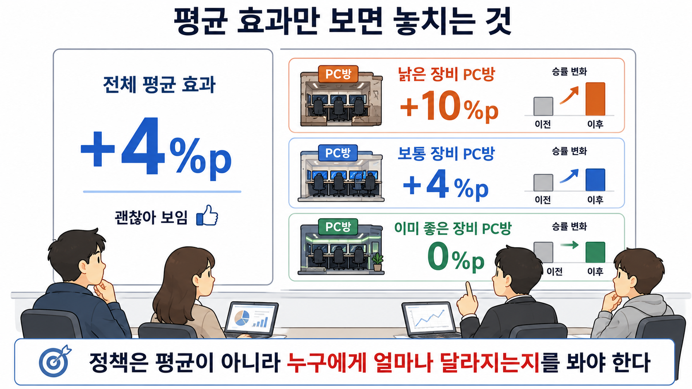

# 20장. 평균 효과에서 개인별 효과로

## 평균은 괜찮아 보이는데 예산은 부족하다

장비 회사가 새 마우스 지원 캠페인을 다시 검토한다.

지난 실험 결과는 꽤 좋아 보인다.

새 마우스를 받은 PC방의 평균 승률은 4%p 올랐다.

회의실에 이런 결론이 올라온다.

```text
새 마우스 평균 효과: +4%p
```

이 숫자만 보면 지원을 계속해도 될 것 같다.

하지만 바로 다음 질문이 나온다.

```text
예산이 부족해서 모든 PC방에 줄 수 없다면,
어디에 먼저 줘야 할까?
```

평균 효과는 이 질문에 바로 답하지 못한다.

평균은 전체를 하나로 합친 숫자다.

하지만 정책은 대상을 골라야 한다.

어떤 PC방은 새 마우스를 받으면 승률이 크게 오를 수 있다.

어떤 PC방은 이미 장비가 좋아서 거의 달라지지 않을 수 있다.

전체 평균이 +4%p라고 해서 모든 PC방이 +4%p 오르는 것은 아니다.

## 같은 평균 안에 다른 효과가 섞여 있다

작은 표로 보자.

PC방을 장비 상태에 따라 세 그룹으로 나눴다고 하자.

| PC방 그룹 | PC방 수 | 기존 장비 상태 | 새 마우스 효과 |
| --- | ---: | --- | ---: |
| A 그룹 | 2곳 | 낡음 | +10%p |
| B 그룹 | 5곳 | 보통 | +4%p |
| C 그룹 | 3곳 | 이미 좋음 | 0%p |

전체 평균은 그룹별 효과와 각 그룹의 PC방 수를 함께 반영한다.

```text
(10 * 2 + 4 * 5 + 0 * 3) / 10 = 4%p
```



그림을 볼 때는 왼쪽의 전체 평균 효과를 먼저 본다.

`+4%p`만 보면 정책이 꽤 좋아 보인다.

그다음 오른쪽의 세 그룹을 비교한다.

낡은 장비 PC방은 크게 달라지고, 이미 좋은 장비 PC방은 거의 달라지지 않는다.

정책을 정할 때 중요한 것은 왼쪽 평균만이 아니다.

오른쪽처럼 누구에게 얼마나 달라지는지도 봐야 한다.

평균만 보면 새 마우스는 괜찮은 정책이다.

하지만 예산이 한 그룹에만 충분하다면 선택은 달라진다.

새 마우스를 먼저 줄 곳은 A 그룹이다.

A 그룹은 장비가 낡아서 효과가 크다.

C 그룹은 이미 장비가 좋아서 새 마우스를 받아도 거의 달라지지 않는다.

이 장의 핵심 질문은 이것이다.

```text
평균적으로 효과가 있는가?
```

에서

```text
누구에게 효과가 큰가?
```

로 질문을 바꾸는 것이다.

## 평균 효과는 전체 결정을 돕는다

먼저 이미 알고 있는 평균 효과부터 정리하자.

전체 평균 효과를 영어로 `Average Treatment Effect`라고 한다.

줄여서 `ATE`라고 쓴다.

한국어로는 전체 평균 처치 효과라고 보면 된다.

ATE는 이런 질문에 답한다.

```text
새 마우스를 전체 PC방에 지원하면,
평균적으로 승률이 얼마나 오를까?
```

이 질문은 중요하다.

새 정책을 전체로 도입할지 말지 판단할 때는 ATE가 도움이 된다.

예를 들어 평균 효과가 +4%p이고 비용도 감당할 수 있다면, 전체 지원을 검토할 수 있다.

하지만 ATE는 대상 선택 문제에는 부족하다.

```text
전체 평균은 +4%p다.
그러면 어느 PC방부터 지원해야 하는가?
```

이 질문에는 답이 빠져 있다.

평균 효과는 전체 방향을 알려 주지만, 우선순위를 알려 주지는 않는다.

## 조건이 비슷한 그룹의 효과를 본다

우선순위를 정하려면 조건을 나눠 봐야 한다.

예를 들어 장비 상태를 보자.

```text
장비가 낡은 PC방
장비가 보통인 PC방
장비가 이미 좋은 PC방
```

각 그룹에서 효과가 다르면 정책도 달라져야 한다.

이때 보는 값이 `CATE`다.

풀어 쓰면 `Conditional Average Treatment Effect`다.

한국어로는 조건부 평균 처치 효과라고 부를 수 있다.

말이 길지만 뜻은 이렇게 잡으면 된다.

```text
조건이 비슷한 대상들 안에서의 평균 효과
```

이 장의 예시에서는 이런 질문이다.

```text
장비가 낡은 PC방들에서는 새 마우스 효과가 얼마나 큰가?
장비가 이미 좋은 PC방들에서는 효과가 얼마나 큰가?
```

수식으로 쓰면 이렇게 된다.

```text
CATE = E[Y1 - Y0 | X]
```

여기서 `Y1`은 처치받았을 때의 결과다.

`Y0`는 처치받지 않았을 때의 결과다.

`X`는 장비 상태, 이용자 수, 지역처럼 대상의 조건이다.

즉 CATE는 이렇게 읽으면 된다.

```text
조건 X가 비슷한 대상들에서,
처치받았을 때와 받지 않았을 때 결과가 평균적으로 얼마나 다른가?
```

## CATE는 승률 예측이 아니다

여기서 헷갈리기 쉬운 지점이 있다.

CATE는 다음 달 승률을 예측하는 값이 아니다.

CATE는 변화량이다.

두 PC방을 보자.

| PC방 | 다음 달 승률 예측 | 새 마우스 효과 예측 |
| --- | ---: | ---: |
| 스타 PC방 | 78% | +1%p |
| 오래된 PC방 | 54% | +9%p |

스타 PC방은 다음 달 승률이 높을 것 같다.

하지만 새 마우스를 받아도 크게 달라지지 않을 수 있다.

오래된 PC방은 다음 달 승률 자체는 낮을 수 있다.

하지만 새 마우스를 받으면 많이 오를 수 있다.

19장에서 본 예측 모델은 주로 이런 질문을 맞힌다.

```text
다음 달 승률이 얼마나 될까?
```

CATE가 묻는 질문은 다르다.

```text
새 마우스를 줬을 때 얼마나 달라질까?
```

그래서 정책 목표가 승률 개선이라면, 높은 승률 예측보다 큰 변화량이 더 중요할 수 있다.

## 개인 하나의 효과를 직접 볼 수는 없다

그렇다고 CATE가 각 PC방의 진짜 효과를 그대로 보여 준다는 뜻은 아니다.

우리는 한 PC방의 두 결과를 동시에 볼 수 없다.

스타 PC방이 새 마우스를 받았다면, 같은 달에 새 마우스를 받지 않은 스타 PC방은 볼 수 없다.

그래서 개인 하나의 효과는 직접 확인하기 어렵다.

우리가 할 수 있는 일은 조건이 비슷한 대상들을 비교하는 것이다.

예를 들어 장비가 낡은 PC방들 안에서, 새 마우스를 받은 곳과 받지 않은 곳을 비교한다.

그 비교가 공정하다고 믿을 수 있으면, 그 그룹의 평균 효과를 추정할 수 있다.

```text
개별 PC방의 숨은 효과를 직접 본다.
```

가 아니다.

더 정확히는 이것이다.

```text
조건이 비슷한 그룹에서 평균적으로 얼마나 달라지는지 본다.
```

이 차이를 놓치면 CATE를 너무 강하게 믿게 된다.

## 효과가 다르면 정책도 달라진다

다시 예산 문제로 돌아가자.

새 마우스를 100곳에만 줄 수 있다.

두 가지 정책이 있다.

```text
정책 1: 다음 달 승률이 높을 것 같은 PC방부터 지원한다.
정책 2: 새 마우스 효과가 클 것 같은 PC방부터 지원한다.
```

목표가 홍보 영상이라면 정책 1이 맞을 수 있다.

높은 승률 PC방이 영상에 나오면 좋아 보이기 때문이다.

하지만 목표가 승률을 실제로 올리는 것이라면 정책 2가 더 맞다.

효과가 큰 곳에 지원해야 같은 예산으로 더 많이 바뀐다.

| PC방 | 다음 달 승률 예측 | 새 마우스 효과 예측 | 승률 개선 목적이라면 |
| --- | ---: | ---: | --- |
| 스타 PC방 | 78% | +1%p | 뒤로 미룸 |
| 중간 PC방 | 62% | +5%p | 검토 |
| 오래된 PC방 | 54% | +9%p | 먼저 지원 |

이 표에서 오래된 PC방은 승률 예측만 보면 낮다.

하지만 효과 예측을 보면 먼저 지원할 만하다.

정책은 목표에 맞는 숫자를 써야 한다.

승률을 맞히는 숫자와 승률을 바꾸는 숫자는 다르다.

## 상호작용은 효과 차이를 표현한다

효과가 조건에 따라 달라진다는 말을 회귀에서는 상호작용으로 표현할 수 있다.

예를 들어 새 마우스 효과가 장비 상태에 따라 달라진다고 하자.

그럼 이런 식으로 생각할 수 있다.

```text
이번 달 승률
= 원래 승률
+ 새 마우스 효과
+ 장비 상태에 따라 달라지는 추가 효과
```

장비가 낡은 곳에서는 새 마우스 효과가 더 클 수 있다.

장비가 이미 좋은 곳에서는 추가 효과가 거의 없을 수 있다.

이때 `새 마우스 여부`와 `장비 상태`를 함께 보는 항이 필요하다.

이것을 상호작용 항이라고 부른다.

처음에는 이름보다 뜻이 중요하다.

```text
처치 효과가 어떤 조건에서 달라지는지 보려는 장치
```

상호작용이 없으면 모델은 모두에게 같은 효과를 주기 쉽다.

상호작용이 있으면 장비 상태에 따라 효과가 다르게 계산될 수 있다.

## 작은 표로 그룹별 효과를 계산한다

아래 표는 이미 비교가 공정하게 만들어졌다고 가정한 작은 예시다.

각 장비 상태 안에서 새 마우스를 받은 PC방과 받지 않은 PC방의 평균 승률을 비교한다.

| 장비 상태 | PC방 수 | 새 마우스 없음 | 새 마우스 있음 | 그룹별 효과 |
| --- | ---: | ---: | ---: | ---: |
| 낡음 | 2곳 | 50% | 60% | +10%p |
| 보통 | 5곳 | 56% | 60% | +4%p |
| 이미 좋음 | 3곳 | 70% | 70% | 0%p |

전체 평균만 보면 이렇게 된다.

```text
(10 * 2 + 4 * 5 + 0 * 3) / 10 = 4%p
```

하지만 정책에는 그룹별 효과가 더 중요하다.

낡은 장비 그룹은 +10%p다.

이미 좋은 장비 그룹은 0%p다.

같은 평균 안에서도 지원 우선순위가 갈린다.

## 계산은 단순하지만 질문은 바뀌었다

앞의 표를 다시 읽으면 이렇게 된다.

```text
낡음 10
보통 4
이미 좋음 0
4.0
```

마지막 줄은 전체 평균 효과다.

위의 세 줄은 조건이 비슷한 그룹별 효과다.

계산은 단순하다.

하지만 질문은 달라졌다.

```text
전체 평균이 얼마인가?
```

에서

```text
어떤 조건에서 효과가 큰가?
```

로 바뀌었다.

## 이 값도 믿으려면 비교가 필요하다

CATE를 말할 때도 앞 장들의 원칙은 사라지지 않는다.

그룹을 나눴다고 해서 자동으로 인과 효과가 되는 것은 아니다.

예를 들어 낡은 장비 PC방 중 새 마우스를 받은 곳이 원래 더 열심히 운영되는 곳이었다면 문제가 된다.

그럼 +10%p가 새 마우스 때문인지, 운영 방식 때문인지 알기 어렵다.

그래서 CATE를 추정할 때도 비교가 공정해야 한다.

```text
같은 장비 상태 안에서
새 마우스 말고 다른 차이가 크지 않은가?
```

이 질문이 필요하다.

무작위 실험이 있으면 가장 좋다.

관측 자료라면 앞에서 배운 조정, 매칭, 성향 점수, DID 같은 방법이 다시 필요할 수 있다.

CATE는 새로운 질문이지, 공정한 비교를 생략하는 방법이 아니다.

## 효과가 큰 순서도 평가해야 한다

정책에서 CATE가 중요한 이유는 순서를 정하기 위해서다.

효과가 큰 PC방부터 지원하면 같은 예산으로 더 큰 변화를 기대할 수 있다.

하지만 효과 예측도 틀릴 수 있다.

모델이 낡은 장비 그룹을 높게 봤지만, 실제로는 보통 장비 그룹에서 더 큰 효과가 날 수도 있다.

그래서 다음 질문이 생긴다.

```text
효과가 크다고 예측한 순서가 정말 좋은 순서인가?
```

이 질문은 단순한 예측 정확도와 다르다.

다음 장에서는 인과 모델을 어떻게 평가할지 본다.

특히 정책에 도움이 되는 순서를 잘 만들었는지 확인하는 방법으로 넘어간다.

## 한 줄 요약

ATE는 전체 평균 효과를 알려 주지만, CATE는 조건이 비슷한 대상들에서 효과가 얼마나 다른지 보여 주므로, 제한된 예산으로 누구에게 먼저 처치할지 정할 때 필요하다.
