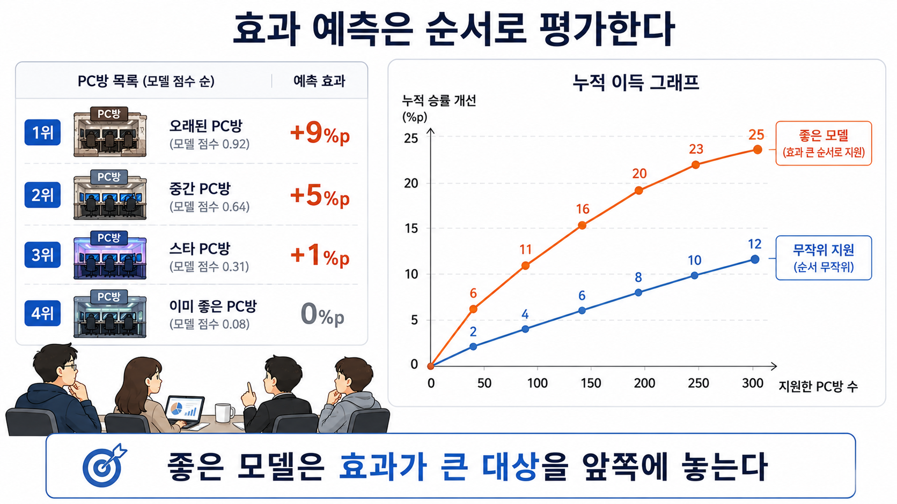

# 21장. 누구에게 처치할지 정하는 문제

## 점수가 높은 순서대로 지원해도 될까?

20장에서 우리는 평균 효과만으로는 부족하다는 것을 봤다. 이제 장비 회사는 새 마우스 효과가 클 것 같은 PC방부터 지원하려고 한다.

데이터팀은 모델을 하나 만들었다. 모델은 각 PC방에 이런 점수를 붙인다.

```text
새 마우스를 줬을 때 승률이 얼마나 오를 것 같은가?
```

회의실에는 이런 목록이 올라온다.

| 순위 | PC방 | 모델이 예측한 효과 |
| ---: | --- | ---: |
| 1 | 오래된 PC방 | +9%p |
| 2 | 중간 PC방 | +5%p |
| 3 | 스타 PC방 | +1%p |
| 4 | 이미 좋은 PC방 | 0%p |

누군가 말한다.

> 점수 높은 순서대로 지원하면 되겠네요.

정책으로 쓰려면 아직 하나가 빠져 있다.

```text
이 순서가 실제로 좋은 순서인지 어떻게 확인하지?
```

예측 모델은 다음 달 승률을 맞히면 정답을 확인할 수 있다. 실제 다음 달 승률이 나오기 때문이다.

하지만 효과 예측은 다르다. 한 PC방에 새 마우스를 줬다면, 같은 달에 새 마우스를 주지 않은 결과는 볼 수 없다.

그래서 개별 PC방의 실제 효과를 바로 채점하기 어렵다.

## 개인별 정답은 없지만 그룹은 볼 수 있다

개별 PC방의 효과는 직접 볼 수 없다. 그렇다고 평가를 포기할 필요는 없다.

PC방을 모델 점수 순서대로 묶어서 볼 수 있다.

예를 들어 모델이 상위권으로 고른 PC방 100곳을 보자. 그 안에서 새 마우스를 받은 곳과 받지 않은 곳이 공정하게 섞여 있다면, 우리는 그 그룹의 평균 효과를 볼 수 있다.

```text
상위 100곳에서
새 마우스를 받은 PC방 평균 승률
- 새 마우스를 받지 않은 PC방 평균 승률
```

이 값이 크면 모델이 효과가 큰 대상을 앞쪽에 놓았을 가능성이 있다.

반대로 상위 그룹에서도 효과가 작다면, 모델 점수가 높은 순서가 정책에 별로 도움이 되지 않을 수 있다.

중요한 생각은 이것이다.

```text
개별 효과는 직접 못 봐도,
모델이 만든 그룹의 평균 효과는 비교할 수 있다.
```

## 좋은 모델은 앞쪽에 효과가 큰 대상을 놓는다

작은 예시로 보자.

모델이 PC방 8곳을 효과가 클 것 같은 순서대로 정렬했다. 그리고 공정한 검증 자료에서 각 PC방의 실제 효과를 그룹 수준으로 확인할 수 있었다고 하자.

| 모델 순위 | PC방 | 실제 효과 |
| ---: | --- | ---: |
| 1 | A | +10%p |
| 2 | B | +8%p |
| 3 | C | +6%p |
| 4 | D | +4%p |
| 5 | E | +2%p |
| 6 | F | +1%p |
| 7 | G | 0%p |
| 8 | H | 0%p |

이 모델은 좋은 순서를 만든 것으로 보인다. 앞쪽에 효과가 큰 PC방이 모여 있다.

예산이 2곳뿐이라면 A와 B를 지원한다. 그러면 기대되는 개선은 이렇다.

```text
10 + 8 = 18%p
```

예산이 4곳이면 A, B, C, D를 지원한다.

```text
10 + 8 + 6 + 4 = 28%p
```

좋은 모델은 적은 수를 지원했을 때도 효과가 큰 대상이 앞쪽에 모여 있다.

## 무작위 순서와 비교한다

모델이 좋은지 보려면 기준이 필요하다. 가장 단순한 기준은 무작위 순서다.

PC방을 아무 순서로나 섞어서 지원한다고 생각해 보자.

위 표의 전체 평균 효과는 이렇다.

```text
(10 + 8 + 6 + 4 + 2 + 1 + 0 + 0) / 8 = 3.875%p
```

무작위로 2곳을 고르면 평균적으로 기대되는 개선은 대략 이렇다.

```text
3.875 × 2 = 7.75%p
```

모델 순서대로 상위 2곳을 고르면 18%p였다.

```text
모델 순서 상위 2곳: 18%p
무작위 2곳: 약 7.75%p
```

이렇게 보면 모델이 정책에 도움이 되는지 더 분명해진다. 좋은 모델은 무작위보다 앞쪽에 효과가 큰 대상을 더 많이 놓는다.



그림을 볼 때는 왼쪽 목록을 먼저 본다. 모델은 효과가 클 것 같은 PC방을 위쪽에 놓는다.

그다음 오른쪽 그래프를 본다. 주황색 선은 모델 순서대로 지원했을 때의 누적 이득이다. 파란색 선은 무작위로 지원했을 때의 누적 이득이다.

좋은 모델이라면 같은 수의 PC방을 지원했을 때 주황색 선이 파란색 선보다 위에 있어야 한다.

## 누적 이득 곡선은 순서가 좋은지 본다

이 생각을 그래프로 그릴 수 있다.

가로축에는 지원한 PC방 수를 둔다. 세로축에는 지금까지 쌓인 승률 개선을 둔다.

```text
1곳 지원했을 때 누적 개선
2곳 지원했을 때 누적 개선
3곳 지원했을 때 누적 개선
...
```

좋은 모델의 선은 초반 구간에서 무작위 선보다 위에 있다. 효과가 큰 PC방을 앞쪽에 놓았기 때문이다.

무작위 순서의 선은 더 천천히 올라간다. 효과가 큰 곳과 작은 곳이 섞이기 때문이다.

이런 방식의 그래프를 **누적 이득 곡선**이라고 부를 수 있다. 영어로는 `cumulative gain curve`다.

이름보다 중요한 것은 읽는 법이다.

```text
같은 수만큼 지원했을 때,
어느 순서가 더 많은 개선을 먼저 가져오는가?
```

## 점수 자체보다 순서가 중요할 때가 많다

여기서 모델 점수의 정확한 크기는 생각보다 덜 중요할 수 있다.

예를 들어 모델이 A의 효과를 +9%p, B의 효과를 +6%p라고 예측했다고 하자. 실제 효과는 A가 +10%p, B가 +8%p일 수 있다.

숫자는 정확히 맞지 않았다. 그래도 순서는 맞았다.

예산이 적어서 상위 몇 곳만 골라야 한다면, 순서가 맞는 것이 중요하다.

반대로 숫자 크기는 맞아 보여도 순서가 틀리면 정책이 나빠진다.

| PC방 | 실제 효과 | 모델 A 순위 | 모델 B 순위 |
| --- | ---: | ---: | ---: |
| A | +10%p | 1 | 4 |
| B | +8%p | 2 | 3 |
| C | +2%p | 3 | 2 |
| D | 0%p | 4 | 1 |

모델 B는 효과가 작은 D를 1위로 놓았다. 예산이 1곳뿐이라면 모델 B는 가장 나쁜 선택을 한다.

그래서 인과 모델 평가는 단순히 숫자를 잘 맞혔는지보다, 정책에 필요한 순서를 잘 만들었는지를 봐야 한다.

## 예측 정확도만 보면 부족하다

19장에서 본 예측 모델은 다음 달 승률을 잘 맞힐 수 있다. 하지만 21장에서 필요한 평가는 다르다.

우리는 다음 달 승률이 높은 PC방을 찾는 것이 아니다. 새 마우스를 줬을 때 많이 달라질 PC방을 찾고 있다.

그래서 이런 지표만으로는 부족하다.

```text
다음 달 승률 예측 오차가 작은가?
```

대신 이런 질문이 필요하다.

```text
모델이 효과가 큰 PC방을 앞쪽에 놓았는가?
앞쪽부터 지원했을 때 실제 이득이 무작위보다 큰가?
```

예측 정확도가 높은 모델이 좋은 정책 순서를 만들 수도 있다. 하지만 항상 그런 것은 아니다.

작은 표로 보면 더 분명하다.

| PC방 | 다음 달 승률 | 새 마우스 지원 효과 |
| --- | ---: | ---: |
| A | 80% | +1%p |
| B | 76% | +1%p |
| C | 55% | +8%p |
| D | 50% | +7%p |

다음 달 승률을 맞히는 모델은 A와 B를 앞에 놓을 것이다. 그 모델은 예측 모델로는 좋아 보인다.

하지만 지원 효과를 기준으로 보면 C와 D가 먼저다.

즉 결과값을 잘 맞히는 능력은, 변화량을 잘 고르는 능력과 다를 수 있다. 효과 모델은 결과값이 아니라 변화량을 다룬다. 평가도 변화량 중심으로 해야 한다.

## 검증 자료는 공정해야 한다

이 장의 평가가 믿을 만하려면 중요한 조건이 있다. 검증 자료에서 새 마우스 지원 여부가 공정하게 정해져 있어야 한다.

가장 좋은 경우는 무작위 실험이다. 예를 들어 일부 PC방에는 무작위로 새 마우스를 주고, 일부는 그대로 둔다. 그러면 모델이 만든 상위 그룹 안에서도 받은 곳과 받지 않은 곳을 비교할 수 있다.

하지만 검증 자료가 공정하지 않으면 문제가 생긴다.

예를 들어 모델 점수가 높은 PC방에만 새 마우스를 줬다면, 상위 그룹 안에서 비교할 받지 않은 PC방이 부족할 수 있다.

또는 운영이 좋은 PC방만 지원받았다면, 효과가 과장될 수 있다.

그래서 인과 모델 평가는 이런 질문을 먼저 확인해야 한다.

```text
모델이 만든 그룹 안에서
처치받은 곳과 받지 않은 곳을 믿고 비교할 수 있는가?
```

이 질문이 해결되지 않으면 누적 이득 곡선도 인과 평가 근거로 쓰기 어렵다.

## 초반 구간은 표본이 작다

상위 5곳만 보면 효과가 크게 보일 수 있다. 하지만 표본이 너무 작으면 한두 곳의 결과가 전체 판단을 크게 바꾼다.

예를 들어 상위 2곳의 실제 효과가 +10%p, +8%p였다고 하자. 다른 달에는 +6%p, +3%p로 나올 수도 있다.

PC방 수가 적으면 한두 곳의 특이한 결과가 전체 판단을 크게 바꾼다.

그래서 누적 이득을 볼 때는 초반 값만 보고 바로 결론 내리면 안 된다. 상위 10%, 20%, 30%처럼 조금 더 넓은 구간에서도 모델이 일관되게 좋은지 확인해야 한다.

가능하면 불확실성 범위도 함께 봐야 한다.

이것은 3장에서 본 불확실성과 같은 생각이다. 숫자가 하나 나왔다고 끝이 아니다. 그 숫자가 결정을 지탱할 만큼 안정적인지 봐야 한다.

## 작은 계산으로 순서를 비교한다

아래 코드는 모델 순서와 무작위 기준선의 누적 이득을 비교한다.

실제 분석에서는 더 많은 자료와 신뢰구간이 필요하지만, 여기서는 읽는 법만 확인한다.

```python
effects_in_model_order = [10, 8, 6, 4, 2, 1, 0, 0]

average_effect = sum(effects_in_model_order) / len(effects_in_model_order)

model_gain = []
random_gain = []

total = 0

for k, effect in enumerate(effects_in_model_order, start=1):
    total += effect
    model_gain.append(total)
    random_gain.append(average_effect * k)

for k in [2, 4, 8]:
    print(k, round(model_gain[k - 1], 1), round(random_gain[k - 1], 1))
```

실행 결과는 다음과 같다.

```text
2 18 7.8
4 28 15.5
8 31 31.0
```

2곳만 지원할 때는 모델 순서가 무작위보다 훨씬 낫다. 4곳을 지원할 때도 모델 순서가 더 낫다.

8곳 모두 지원하면 두 방식은 같은 총합에 도착한다. 결국 모든 PC방을 지원했기 때문이다.

이 곡선은 중간 과정이 중요하다. 예산이 제한되어 있을 때, 좋은 모델은 효과가 큰 대상을 앞쪽에 더 잘 놓는다.

## 평가는 결정 문제에서 나온다

인과 모델 평가에서 중요한 것은 모델의 목적이다.

목적이 정책 순서를 만드는 것이라면, 평가는 그 순서가 좋은지 봐야 한다.

목적이 전체 평균 효과를 추정하는 것이라면, 평가는 평균 효과 추정이 안정적인지 봐야 한다.

목적이 특정 그룹을 찾는 것이라면, 평가는 그 그룹에서 실제 효과가 큰지 봐야 한다.

평가 지표는 모델 이름에서 나오지 않는다. 결정해야 하는 문제에서 나온다.

이 장에서는 “누구에게 먼저 처치할까?”라는 결정 문제를 봤다. 그래서 모델이 효과가 큰 대상을 앞에 놓는지 평가했다.

다음 장부터는 이런 효과 예측 모델을 실제로 어떻게 만드는지 본다.

## 한 줄 요약

인과 모델 평가는 개별 효과 정답을 맞히는 일이 아니라, 모델이 효과가 큰 대상을 앞쪽에 놓아 제한된 예산에서 무작위보다 나은 선택 순서를 만드는지 확인하는 일이다.
