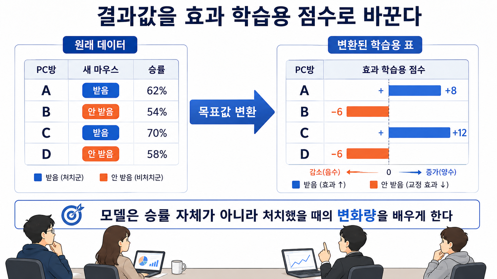

# 22장. 기존 머신러닝 모델로 효과 추정하기

## 모델에게 승률만 맞히라고 하면 부족하다

21장에서 우리는 효과 예측 모델을 평가하는 법을 봤다. 좋은 모델은 효과가 큰 PC방을 앞쪽에 놓아야 했다.

그렇다면 이제 질문이 생긴다.

```text
그런 모델은 어떻게 만들까?
```

가장 쉬운 생각은 기존 머신러닝 모델을 쓰는 것이다.

예를 들어 데이터팀이 다음 달 승률을 잘 맞히는 모델을 이미 가지고 있다고 하자. 그 모델에 PC방 정보를 넣으면 이런 숫자가 나온다.

| PC방 | 다음 달 승률 예측 |
| --- | ---: |
| A | 70% |
| B | 62% |
| C | 55% |

하지만 우리는 이제 승률 자체를 맞히려는 것이 아니다. 정책에 필요한 질문은 이것이다.

```text
새 마우스를 줬을 때 얼마나 달라질까?
```

모델에게 다음 달 승률만 맞히라고 하면, 원래 잘하는 PC방을 잘 찾을 수는 있다. 하지만 새 마우스로 많이 달라질 PC방을 찾는다는 보장은 없다.

그래서 모델이 맞혀야 하는 값을 바꿔야 한다.

## 효과 정답 칸은 비어 있다

보통 머신러닝 모델은 정답이 있어야 배운다.

예를 들어 승률 예측 모델은 이렇게 배운다.

| PC방 | 입력 정보 | 정답 |
| --- | --- | ---: |
| A | 장비 상태, 이용자 수, 지역 | 다음 달 승률 70% |
| B | 장비 상태, 이용자 수, 지역 | 다음 달 승률 62% |

모델은 입력 정보를 보고 정답을 맞히는 연습을 한다.

그런데 처치 효과에는 문제가 있다. 각 PC방의 효과는 이렇게 생겼다.

```text
새 마우스를 받았을 때의 승률
- 새 마우스를 받지 않았을 때의 승률
```

하지만 한 PC방에서 두 결과를 동시에 볼 수 없다. 새 마우스를 받은 A PC방의 결과는 볼 수 있다. 하지만 같은 달에 새 마우스를 받지 않은 A PC방의 결과는 볼 수 없다.

그래서 효과 모델의 정답 칸은 비어 있는 것처럼 보인다.

```text
PC방 정보 -> 효과 정답
```

이 정답을 직접 관측할 수 없기 때문이다.

## 정답 대신 평균이 맞는 점수를 만든다

정답을 직접 볼 수 없다고 해서 아무것도 못 하는 것은 아니다.

먼저 우리가 정말 알고 싶은 값을 다시 보자. 장비가 낡은 PC방들을 따로 모아 봤더니 결과가 이렇게 나왔다고 하자.

| 그룹 | 평균 승률 |
| --- | ---: |
| 새 마우스를 받은 PC방 | 60% |
| 새 마우스를 받지 않은 PC방 | 50% |

이 그룹에서는 새 마우스를 준 쪽이 10%p 높다.

```text
60% - 50% = 10%p
```

문제는 머신러닝 모델이 보통 이런 그룹 평균표를 바로 배우지 않는다는 것이다. 모델은 보통 한 줄씩 생긴 자료를 받는다.

```text
PC방 A의 정보 -> 정답
PC방 B의 정보 -> 정답
PC방 C의 정보 -> 정답
```

그래서 질문이 바뀐다.

```text
각 PC방 한 줄마다 넣을 수 있는 정답 비슷한 숫자를 만들 수 있을까?
```

이 숫자가 각 PC방의 실제 효과일 필요는 없다. 어차피 각 PC방의 실제 효과는 직접 볼 수 없기 때문이다.

대신 조건이 비슷한 PC방들을 모아 평균냈을 때, 그 평균이 효과와 맞아야 한다.

이 장에서 만드는 숫자는 그런 용도다. 한 줄에서는 거칠어도 된다. 비슷한 PC방들을 모아 평균냈을 때 효과가 나오면 된다.

## 받은 결과와 받지 않은 결과를 반대 방향에 놓는다

그림에서는 먼저 왼쪽을 본다.

왼쪽 표에는 우리가 실제로 관측한 것이 있다. PC방마다 새 마우스를 받았는지, 그리고 그 달 승률이 얼마였는지다.

오른쪽 표에는 모델이 배울 학습용 점수가 있다. 받은 PC방은 양수 방향으로, 받지 않은 PC방은 음수 방향으로 놓인다.



방향이 중요하다.

새 마우스를 받은 PC방의 결과는 효과를 계산할 때 `받은 쪽 평균`에 들어간다. 그래서 양수로 둔다.

새 마우스를 받지 않은 PC방의 결과는 효과를 계산할 때 빼야 하는 쪽이다. 그래서 음수로 둔다.

```text
효과 = 받은 쪽 평균 - 받지 않은 쪽 평균
```

이 뺄셈을 한 줄짜리 점수 안에 넣어 두는 것이다.

## 왜 2를 곱할까?

아직 하나가 남았다.

왜 `+60`, `-50`만 쓰지 않고 `60 × 2`, `50 × -2`를 할까?

새 마우스를 받은 곳과 받지 않은 곳이 반반이라고 하자. `+60`, `-50`을 한 줄씩 넣고 전체 평균을 내면 이렇게 된다.

```text
(60 + -50) / 2
= 5
```

우리가 원한 값은 10%p였다. 그런데 5가 나왔다.

전체 자료의 절반은 받은 쪽이고, 나머지 절반은 받지 않은 쪽이기 때문이다. 그래서 각 쪽을 두 배로 키워야 한다.

```text
(60 × 2 + 50 × -2) / 2
= (120 - 100) / 2
= 10
```

이제 원하는 값이 나온다.

그래서 새 마우스를 받을 확률이 50%일 때는 이렇게 바꾼다.

```text
새 마우스를 받은 PC방: 관측 승률 × 2
새 마우스를 받지 않은 PC방: 관측 승률 × -2
```

작은 예시를 보자.

| PC방 | 새 마우스 | 관측 승률 | 효과 학습용 점수 |
| --- | --- | ---: | ---: |
| A | 받음 | 62% | 124 |
| B | 받지 않음 | 54% | -108 |
| C | 받음 | 70% | 140 |
| D | 받지 않음 | 58% | -116 |

중요한 점은 이 숫자가 한 PC방의 실제 효과가 아니라는 것이다. A PC방의 점수 124가 A의 효과라는 뜻은 아니다.

이 점수는 모델 학습용으로 만든 숫자다. 한 줄씩 보면 거칠다. 하지만 조건이 비슷한 PC방들을 모아 평균내면, 받은 쪽과 받지 않은 쪽의 차이를 나타내도록 만들어져 있다.

이런 방식을 **target transformation**이라고 부른다. 한국어로는 목표값 변환이라고 생각하면 된다.

## 모델이 배우는 대상이 바뀐다

이제 모델에게 줄 자료가 생겼다.

승률 예측 모델은 보통 이렇게 배운다.

```text
PC방 정보 -> 다음 달 승률
```

목표값 변환을 쓰면 이렇게 바뀐다.

```text
PC방 정보 -> 효과 학습용 점수
```

모델은 이제 승률이 높은 PC방을 찾는 연습을 하지 않는다. 새 마우스를 줬을 때 변화가 클 만한 PC방을 찾는 연습을 한다.

정확히 말하면, 비슷한 PC방들을 모아 봤을 때 효과 차이가 커지는 방향을 배우는 것이다.

## 50%가 아니면 나누는 값이 달라진다

앞의 예시는 새 마우스를 받을 확률이 50%일 때였다.

하지만 실제 실험에서는 30%만 받을 수도 있고, 70%가 받을 수도 있다. 그럼 `2`와 `-2`를 그대로 쓰면 안 된다. 확률이 달라졌기 때문이다.

예를 들어 새 마우스를 받을 확률이 25%라면 받은 PC방은 드문 쪽이다. 받은 PC방은 전체 자료에 적게 나온다.

적게 나오는 쪽을 그대로 두면 평균에서 너무 작게 반영된다. 그래서 더 크게 키운다.

일반적인 생각은 이렇다.

```text
받은 PC방: 관측 결과 / 받을 확률
받지 않은 PC방: - 관측 결과 / 받지 않을 확률
```

받을 확률이 50%면 `1 / 0.5 = 2`라서 앞의 규칙과 같아진다.

받을 확률이 25%면 `1 / 0.25 = 4`가 된다. 드물게 받은 쪽을 네 배로 키우는 것이다.

이 장에서 지금 외울 것은 공식이 아니다. 중요한 생각은 이것이다.

```text
적게 관측되는 쪽은 평균에서 작게 보이므로 더 크게 보정한다.
그래야 받은 쪽과 받지 않은 쪽의 차이가 평균에 제대로 남는다.
```

## 기존 모델을 그대로 쓸 수 있다

목표값을 바꾸고 나면 기존 머신러닝 모델을 쓸 수 있다.

순서는 이렇다.

```text
1. PC방 정보를 준비한다.
2. 새 마우스를 받았는지와 관측 승률을 본다.
3. 관측 승률을 효과 학습용 점수로 바꾼다.
4. 모델에게 PC방 정보로 그 점수를 예측하게 한다.
5. 예측값을 효과 점수처럼 사용해 PC방을 정렬한다.
```

이 방법이 `plug-and-play`라고 불리는 이유는 여기 있다. 목표값만 바꾸면, 기존 예측 모델을 거의 그대로 쓸 수 있기 때문이다.

랜덤 포레스트, 부스팅 모델, 선형 모델 같은 일반 예측 모델을 쓸 수 있다.

하지만 조심해야 한다. 모델이 배우는 것은 승률이 아니라 변환된 효과 학습용 점수다. 그래서 결과를 읽을 때도 승률 예측처럼 읽으면 안 된다.

```text
이 PC방의 다음 달 승률이 70%다.
```

가 아니라

```text
이 PC방은 새 마우스 효과가 클 가능성이 있다.
```

에 가깝다.

## 코드로 변환을 확인한다

아래 코드는 새 마우스 배정 확률이 50%인 경우의 목표값 변환을 계산한다.

```python
rows = [
    {"pc": "A", "new_mouse": 1, "win_rate": 62},
    {"pc": "B", "new_mouse": 0, "win_rate": 54},
    {"pc": "C", "new_mouse": 1, "win_rate": 70},
    {"pc": "D", "new_mouse": 0, "win_rate": 58},
]

treatment_probability = 0.5

for row in rows:
    if row["new_mouse"] == 1:
        transformed = row["win_rate"] / treatment_probability
    else:
        transformed = -row["win_rate"] / (1 - treatment_probability)
    print(row["pc"], int(transformed))
```

실행 결과는 다음과 같다.

```text
A 124
B -108
C 140
D -116
```

이 숫자는 실제 승률이 아니다. 효과를 배우기 위해 만든 학습용 점수다.

## 단순하지만 값이 크게 튈 수 있다

목표값 변환은 쓰기 쉽다. 기존 모델을 그대로 쓸 수 있기 때문이다.

하지만 대가가 있다. 변환된 점수는 매우 커질 수 있다.

예를 들어 받지 않은 PC방의 승률이 58%라면 학습용 점수는 -116이 된다. 다음 행에서는 +140이 나올 수도 있다.

모델 입장에서는 정답 숫자가 매우 거칠다. 그래서 자료가 적으면 모델이 우연한 차이를 배울 수 있다.

21장에서 본 것처럼, 훈련 자료에서는 좋아 보이지만 새 자료에서는 약해질 수 있다.

이 방법은 단순함을 얻는 대신 큰 학습용 점수를 감수한다. 자료가 많을수록 유리하고, 자료가 적을수록 조심해야 한다.

## 무작위 배정이 중요하다

목표값 변환이 설득력을 가지려면 처치 배정이 공정해야 한다. 가장 쉬운 경우는 무작위 실험이다.

새 마우스를 받을지 말지가 무작위로 정해졌다면, 받은 곳과 받지 않은 곳은 평균적으로 비슷해진다. 그때 변환된 점수의 평균이 효과를 향한다.

하지만 새 마우스를 원래 잘하는 PC방에만 줬다면 어떻게 될까?

받은 곳의 승률이 높은 이유가 새 마우스 때문인지, 원래 잘해서인지 구분하기 어렵다. 이 상태에서 목표값만 바꿔도 문제가 해결되지는 않는다.

목표값 변환은 공정한 비교를 대신하지 않는다. 공정한 비교가 어느 정도 만들어졌을 때, 효과를 모델이 배우기 쉬운 숫자로 바꾸는 방법이다.

## 처치가 둘 중 하나가 아니면 더 어렵다

지금까지는 새 마우스를 받았는가, 받지 않았는가처럼 둘 중 하나인 처치를 봤다. 이런 경우에는 계산이 비교적 단순하다.

받은 쪽은 더하고, 받지 않은 쪽은 뺀다.

하지만 현실에는 정도가 있는 처치도 있다. 예를 들어 지원금을 0만원, 5만원, 10만원, 20만원처럼 다르게 줄 수 있다.

이때 질문은 바뀐다.

```text
지원금을 더 늘리면 승률이 얼마나 더 오르는가?
```

이런 경우에는 단순히 받은 쪽과 받지 않은 쪽을 나누기 어렵다. 5만원 지원과 20만원 지원은 같은 처치가 아니다.

그래서 이 장의 방법을 그대로 가져다 쓰기 어렵다. 목표값 변환은 먼저 `받음`과 `받지 않음`이 분명히 나뉘는 문제에서 이해하는 것이 좋다.

## 다음 장으로

목표값 변환은 좋은 출발점이다. 모델에게 승률 자체가 아니라 효과 학습용 점수를 예측하게 만든다.

하지만 이 방식은 변환된 점수가 크게 튈 수 있다는 문제가 있다. 그리고 처치받은 결과와 받지 않은 결과를 따로 모델링하고 싶을 때는 다른 접근이 필요하다.

다음 장에서는 기존 예측 모델을 조합해서 효과를 추정하는 방법을 본다. 대표적으로 `S learner`, `T learner`, `X learner` 같은 방법이 있다.

이름보다 먼저 볼 질문은 이것이다.

```text
처치받은 결과와 받지 않은 결과를 모델 안에서 어떻게 나눠서 배울 것인가?
```

## 한 줄 요약

목표값 변환은 관측 결과를 효과 학습용 점수로 바꿔 기존 머신러닝 모델이 처치 효과를 예측하게 만드는 단순한 방법이지만, 공정한 배정과 충분한 자료가 없으면 크게 틀릴 수 있다.
