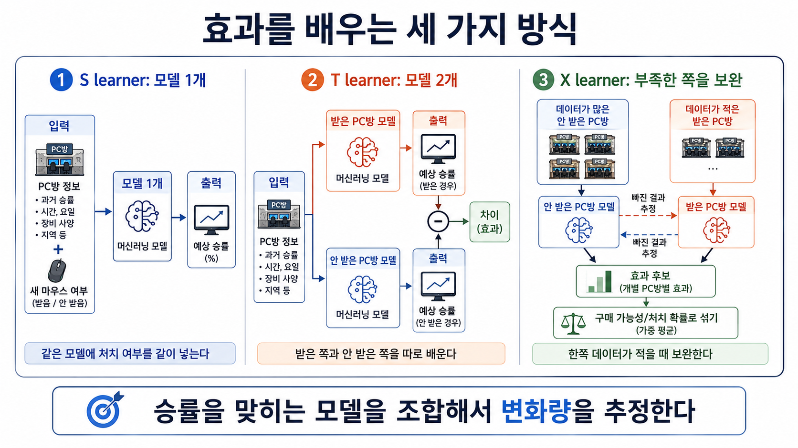

# 23장. 모델을 나눠서 효과 추정하기

## 지난 방법은 정답 숫자가 너무 거칠었다

22장에서 우리는 관측 승률을 효과 학습용 점수로 바꿨다.

새 마우스를 받은 PC방은 양수 방향으로, 받지 않은 PC방은 음수 방향으로 보냈다.

그렇게 하면 기존 머신러닝 모델이 승률 자체가 아니라 변화량을 배우게 할 수 있었다.

하지만 문제가 있었다.

한 줄의 학습용 점수가 너무 거칠었다.

예를 들어 승률 70%인 PC방은 `140`이 되고, 승률 58%인 PC방은 `-116`이 됐다.

이 숫자는 실제 승률도 아니고, 그 PC방의 진짜 효과도 아니다.

그래서 자료가 적으면 모델이 이상한 숫자에 쉽게 끌려갈 수 있다.

데이터팀 회의에서 누군가 이렇게 말한다.

```text
그럼 굳이 이상한 점수를 만들지 말고,
승률 예측 모델을 여러 개 조합하면 안 되나?
```

이번 장의 질문은 이것이다.

```text
승률을 예측하는 모델을 조합해서
새 마우스의 효과를 추정할 수 있을까?
```

## 효과는 두 예측의 차이로 볼 수 있다

우리가 알고 싶은 것은 여전히 같다.

```text
새 마우스를 받았을 때의 승률
- 새 마우스를 받지 않았을 때의 승률
```

한 PC방에서 두 결과를 동시에 볼 수는 없다.

하지만 모델에게 두 상황을 각각 예측하게 만들 수는 있다.

예를 들어 B PC방에 대해 모델이 이렇게 말한다고 하자.

| 상황 | 예상 승률 |
| --- | ---: |
| 새 마우스를 받으면 | 66% |
| 새 마우스를 받지 않으면 | 59% |

그러면 B PC방의 예상 효과는 이렇게 읽을 수 있다.

```text
66 - 59 = 7%p
```

이제 문제는 하나다.

```text
두 상황의 예상 승률을 어떻게 만들 것인가?
```

여기서 세 가지 방식이 나온다.

`S learner`, `T learner`, `X learner`다.

이름보다 먼저 볼 것은 모델을 어떻게 나누는가다.

아래 그림은 세 방법의 차이를 한 번에 보여준다.

왼쪽은 모델 하나에 새 마우스 여부를 함께 넣는 방식이다.

가운데는 받은 쪽 모델과 받지 않은 쪽 모델을 따로 만드는 방식이다.

오른쪽은 한쪽 자료가 적을 때 빠진 결과를 예측해 효과 후보를 만드는 방식이다.

그림의 마지막 줄에 나온 `처치 확률`은 어떤 PC방이 새 마우스를 받을 가능성을 뜻한다.



## S learner는 모델 하나에 모두 넣는다

가장 단순한 방법은 모델을 하나만 쓰는 것이다.

PC방 정보와 새 마우스 여부를 함께 넣고, 승률을 예측하게 한다.

```text
PC방 정보 + 새 마우스 여부 -> 예상 승률
```

이 방식이 **S learner**다.

S는 single, 즉 모델 하나라는 뜻으로 이해하면 된다.

예를 들어 모델에게 같은 PC방 정보를 두 번 넣어 본다.

첫 번째는 새 마우스를 받았다고 넣는다.

두 번째는 새 마우스를 받지 않았다고 넣는다.

| 입력 | 예상 승률 |
| --- | ---: |
| B PC방 정보 + 새 마우스 받음 | 66% |
| B PC방 정보 + 새 마우스 받지 않음 | 59% |

그리고 둘의 차이를 효과로 읽는다.

```text
66 - 59 = 7%p
```

S learner의 장점은 단순함이다.

모델 하나만 만들면 된다.

자료가 많지 않아도 일단 시작하기 쉽다.

하지만 약점도 있다.

모델이 새 마우스 여부를 중요하지 않은 정보로 봐 버릴 수 있다.

예를 들어 PC방의 원래 실력, 지역, 손님 수가 승률을 훨씬 잘 설명한다고 하자.

그러면 모델은 새 마우스 여부를 거의 무시할 수 있다.

그 결과 효과를 너무 작게 볼 수 있다.

```text
새 마우스가 조금은 영향을 주는데,
모델 하나가 그 차이를 잘 못 잡을 수 있다.
```

## T learner는 받은 쪽과 안 받은 쪽을 따로 배운다

S learner가 새 마우스 여부를 무시할 수 있다면, 더 직접적인 방법을 쓸 수 있다.

처음부터 자료를 둘로 나누는 것이다.

```text
새 마우스를 받은 PC방 자료 -> 받은 경우의 승률 모델
새 마우스를 받지 않은 PC방 자료 -> 받지 않은 경우의 승률 모델
```

이 방식이 **T learner**다.

T는 two, 즉 모델 두 개라고 이해하면 된다.

이제 B PC방을 평가할 때는 두 모델에 같은 PC방 정보를 넣는다.

| 모델 | B PC방 예상 승률 |
| --- | ---: |
| 받은 경우를 배운 모델 | 66% |
| 받지 않은 경우를 배운 모델 | 59% |

효과는 두 예측의 차이다.

```text
66 - 59 = 7%p
```

T learner의 장점은 분명하다.

받은 쪽과 받지 않은 쪽을 억지로 한 모델 안에 넣지 않는다.

각자 따로 배운다.

그래서 새 마우스 효과를 더 잘 드러낼 수 있다.

하지만 여기에도 약점이 있다.

두 그룹의 자료가 충분히 있어야 한다.

예를 들어 새 마우스를 받은 PC방이 1,000곳이고, 받지 않은 PC방이 20곳뿐이라고 하자.

받은 경우의 모델은 꽤 잘 배울 수 있다.

하지만 받지 않은 경우의 모델은 자료가 너무 적다.

그 모델이 흔들리면 두 예측의 차이도 흔들린다.

```text
두 모델 중 하나가 약하면,
효과 추정도 같이 약해진다.
```

## X learner는 적은 쪽을 보완하려고 한다

현실에서는 한쪽 자료가 훨씬 적은 일이 자주 생긴다.

새 마우스를 주는 일이 비싸다면, 받은 PC방이 적을 수 있다.

반대로 이벤트를 크게 했다면, 받지 않은 PC방이 적을 수도 있다.

T learner는 이럴 때 불안해진다.

한쪽 모델이 자료 부족으로 약해지기 때문이다.

**X learner**는 이 문제를 줄이려는 방법이다.

핵심 생각은 이렇다.

```text
한쪽 모델이 약하면,
다른 쪽 모델을 이용해 빠진 결과를 채워 보고,
그 차이를 다시 배우자.
```

예를 들어 새 마우스를 받은 A PC방을 보자.

A의 실제 승률은 관측했다.

하지만 A가 새 마우스를 받지 않았다면 어땠을지는 모른다.

이때 받지 않은 PC방들로 만든 모델을 사용해서 A의 받지 않았을 때 승률을 예측한다.

| A PC방 | 승률 |
| --- | ---: |
| 실제로 새 마우스를 받았을 때 | 70% |
| 모델이 예측한 받지 않았을 때 | 62% |

그러면 A의 효과 후보는 이렇게 만든다.

```text
70 - 62 = 8%p
```

이번에는 새 마우스를 받지 않은 D PC방을 보자.

D의 실제 승률은 관측했다.

하지만 D가 새 마우스를 받았다면 어땠을지는 모른다.

이번에는 받은 PC방들로 만든 모델을 사용해서 D의 받았을 때 승률을 예측한다.

| D PC방 | 승률 |
| --- | ---: |
| 모델이 예측한 받았을 때 | 63% |
| 실제로 새 마우스를 받지 않았을 때 | 58% |

그러면 D의 효과 후보는 이렇게 만든다.

```text
63 - 58 = 5%p
```

X learner는 이렇게 만든 효과 후보를 다시 학습한다.

그래서 단순히 받은 모델과 받지 않은 모델을 빼는 것보다, 자료가 적은 쪽의 불안정함을 조금 줄이려 한다.

## 왜 성향 점수가 다시 나오나

X learner에는 한 가지가 더 필요하다.

두 효과 후보를 어떤 비율로 섞을지 정해야 한다.

이때 11장에서 봤던 성향 점수와 비슷한 생각이 다시 나온다.

여기서는 어렵게 생각하지 말자.

성향 점수는 어떤 PC방이 새 마우스를 받을 가능성이다.

어떤 PC방의 성향 점수가 0.9라면, 그 PC방은 자료 안에서 새 마우스를 받은 쪽으로 관측될 가능성이 높았다는 뜻이다.

성향 점수가 0.1이라면, 받지 않은 쪽으로 관측될 가능성이 높았다는 뜻이다.

그래서 X learner는 두 효과 후보를 섞을 때 이 확률을 사용한다.

```text
받을 가능성이 높았던 PC방 -> 받은 쪽에서 만든 효과 후보의 비중을 더 크게 둔다
받을 가능성이 낮았던 PC방 -> 받지 않은 쪽에서 만든 효과 후보의 비중을 더 크게 둔다
```

중요한 것은 성향 점수가 마우스 효과 자체가 아니라는 점이다.

성향 점수는 두 효과 후보를 섞는 비율을 정하는 보조 정보다.

## 세 방법은 순서가 아니라 선택지다

S learner, T learner, X learner는 더 어려운 순서로 외울 필요가 없다.

상황이 다를 때 고르는 선택지로 보면 된다.

| 방법 | 어떻게 배우나 | 언제 먼저 생각할까 | 조심할 점 |
| --- | --- | --- | --- |
| S learner | 모델 하나에 처치 여부를 함께 넣는다 | 단순하게 시작하고 싶을 때 | 처치 효과를 작게 볼 수 있다 |
| T learner | 받은 쪽과 안 받은 쪽 모델을 따로 만든다 | 두 그룹 자료가 충분할 때 | 한쪽 자료가 적으면 흔들린다 |
| X learner | 빠진 결과를 예측해 효과 후보를 만들고 다시 배운다 | 한쪽 자료가 적을 때 | 구조가 복잡하고 성향 점수가 필요하다 |

이 표에서 가장 중요한 기준은 이것이다.

```text
내 자료에서 받은 쪽과 받지 않은 쪽이 얼마나 충분한가?
```

두 그룹이 모두 충분하고 차이가 잘 보이면 T learner가 자연스럽다.

한 모델로도 처치 차이가 잘 잡히면 S learner가 간단하다.

한쪽 자료가 적어서 T learner가 불안하면 X learner를 생각해 볼 수 있다.

## 두 예측값의 차이를 읽는다

```text
B 7
```

이 숫자는 B PC방의 실제로 관측된 효과가 아니다.

두 상황의 예상 승률을 만든 뒤, 그 차이를 효과로 읽은 값이다.

## 좋은 모델이어도 비교가 공정해야 한다

여기서 조심할 점이 있다.

S learner, T learner, X learner는 모두 예측 모델을 조합하는 방법이다.

하지만 예측 모델을 잘 만든다고 해서 자동으로 인과 효과가 맞아지는 것은 아니다.

새 마우스를 원래 잘하는 PC방에만 줬다면 여전히 문제가 남는다.

그 자료로 모델을 만들면, 모델은 새 마우스 효과와 원래 실력 차이를 함께 배울 수 있다.

그래서 이 장의 방법도 공정한 비교를 필요로 한다.

무작위 실험 자료가 있으면 가장 좋다.

실험이 아니라면, 적어도 왜 받은 그룹과 받지 않은 그룹을 비교해도 되는지 따져야 한다.

모델은 비교 문제를 자동으로 없애 주지 않는다.

다만 비교 조건이 어느 정도 갖춰졌을 때, 개인별 효과를 더 유연하게 추정하게 도와준다.

## 다음 장으로

이번 장에서는 기존 예측 모델을 조합해서 효과를 추정하는 세 가지 방식을 봤다.

S learner는 모델 하나를 쓴다.

T learner는 받은 쪽과 받지 않은 쪽 모델을 따로 만든다.

X learner는 한쪽 자료가 적을 때 빠진 결과를 예측해 보완하려고 한다.

하지만 여기까지 와도 한 가지 문제가 남는다.

예측 모델을 많이 쓰면, 모델이 만든 오차가 효과 추정에 들어올 수 있다.

다음 장에서는 이런 보조 예측의 오차가 최종 효과 추정을 망치지 않게 하려는 방법을 본다.

## 한 줄 요약

S/T/X learner는 승률 예측 모델을 하나로 쓰거나, 둘로 나누거나, 부족한 쪽을 보완해서 개인별 처치 효과를 추정하려는 선택지다.
