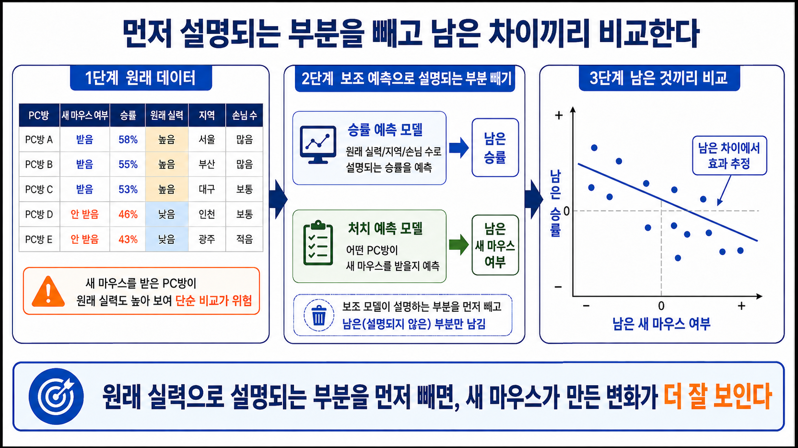

# 24장. 먼저 설명되는 부분을 빼고 비교하기

## 모델을 많이 쓴다고 비교 문제가 사라지지는 않는다

23장에서 우리는 기존 예측 모델을 조합해 개인별 효과를 추정했다.

S learner는 모델 하나를 썼고, T learner는 모델 두 개를 썼고, X learner는 빠진 결과를 예측해 보완했다.

이제 데이터팀은 제법 그럴듯한 도구를 갖게 됐다.

그런데 회의실에서 한 사람이 묻는다.

```text
우리가 만든 예측 모델이 조금 틀리면,
효과 추정도 같이 틀어지는 거 아냐?
```

이 질문은 중요하다.

인과추론에서 모델은 보조 도구일 뿐이다.

우리가 진짜 알고 싶은 것은 새 마우스가 승률을 얼마나 바꾸는가다.

그런데 보조 모델이 원래 실력, 지역, 손님 수 같은 조건을 잘못 처리하면, 그 실수가 효과 추정에 섞일 수 있다.

이번 장의 질문은 이것이다.

```text
보조 예측 모델을 쓰되,
그 모델의 작은 실수가 효과 추정에 덜 들어오게 만들 수 있을까?
```

## 먼저 원래 실력으로 설명되는 승률을 뺀다

PC방 승률에는 새 마우스 말고도 많은 것이 섞여 있다.

원래 게임을 잘하는 손님이 많은지, 지역이 어디인지, 주말 손님이 많은지, 장비가 얼마나 낡았는지 같은 조건이 승률을 바꾼다.

그래서 승률만 보면 새 마우스 효과가 잘 보이지 않는다.

작은 예시를 보자.

| PC방 | 관측 승률 | 원래 조건으로 예상한 승률 | 남은 승률 |
| --- | ---: | ---: | ---: |
| A | 72% | 68% | +4 |
| B | 61% | 64% | -3 |
| C | 58% | 55% | +3 |

`남은 승률`은 이렇게 만든다.

```text
관측 승률 - 원래 조건으로 예상한 승률
```

A PC방은 승률이 72%다.

그런데 원래 조건만 봐도 68% 정도는 나올 것 같았다.

그러면 A에서 남는 것은 +4다.

이 +4는 승률 전체가 아니다.

원래 조건으로 설명되는 부분을 뺀 뒤 남은 차이다.

이렇게 하면 승률에서 원래 실력이나 지역으로 설명되는 부분을 먼저 걷어낼 수 있다.

## 새 마우스를 받은 이유도 빼야 한다

승률에서 설명되는 부분만 빼면 끝일까?

아니다.

새 마우스를 누가 받았는지도 그냥 우연이 아닐 수 있다.

예를 들어 회사가 원래 잘하는 PC방에 먼저 새 마우스를 줬다고 하자.

그러면 `새 마우스를 받음`이라는 정보 안에도 원래 실력이 섞여 있다.

그래서 처치 쪽에서도 설명되는 부분을 빼야 한다.

이번에는 새 마우스 여부를 예측해 본다.

| PC방 | 실제로 새 마우스 받음 | 원래 조건으로 예상한 받을 가능성 | 남은 새 마우스 여부 |
| --- | ---: | ---: | ---: |
| A | 1 | 0.8 | +0.2 |
| B | 0 | 0.3 | -0.3 |
| C | 1 | 0.4 | +0.6 |

`남은 새 마우스 여부`는 이렇게 만든다.

```text
실제로 받았는가 - 원래 조건으로 예상한 받을 가능성
```

A PC방은 실제로 새 마우스를 받았다.

하지만 원래 조건만 봐도 받을 가능성이 0.8로 높았다.

그러면 새 마우스 여부에서 남는 것은 +0.2다.

C PC방도 실제로 받았다.

하지만 원래 조건으로는 받을 가능성이 0.4였다.

그러면 남는 것은 +0.6이다.

두 PC방 모두 새 마우스를 받았지만, 남은 값은 다르다.

이 값은 `원래 조건으로 설명되지 않는 처치 차이`를 뜻한다.

## 남은 것끼리 비교한다

이제 두 가지가 생겼다.

```text
남은 승률
남은 새 마우스 여부
```

이 둘을 비교한다.

왜 원래 승률과 원래 새 마우스 여부를 바로 비교하지 않을까?

거기에는 원래 실력, 지역, 손님 수 같은 조건이 섞여 있기 때문이다.

우리는 그 부분을 먼저 빼고 싶다.

그래서 비교를 이렇게 바꾼다.

```text
관측 승률 vs 새 마우스 여부
```

가 아니라

```text
남은 승률 vs 남은 새 마우스 여부
```

를 본다.

이 방법의 핵심은 어렵지 않다.

```text
조건으로 설명되는 부분을 양쪽에서 먼저 뺀다.
그다음 남은 차이끼리 비교한다.
```

그림은 이 과정을 세 단계로 보여준다.

왼쪽에서는 원래 데이터만 보면 새 마우스를 받은 PC방이 원래 실력도 높아 보여 단순 비교가 위험하다는 점을 본다.

가운데에서는 승률 예측 모델과 처치 예측 모델이 각각 설명할 수 있는 부분을 먼저 뺀다.

오른쪽에서는 `남은 승률`과 `남은 새 마우스 여부`만 놓고 효과를 추정한다.



이렇게 하면 원래 실력 때문에 생긴 차이가 효과 추정에 덜 섞인다.

## 이 작업의 이름은 residualization이다

이제 이름을 붙이자.

어떤 값에서 예측 가능한 부분을 뺀 나머지를 `residual`이라고 부른다.

한국어로는 잔차라고도 한다.

하지만 처음에는 이렇게 이해하면 충분하다.

```text
residual = 실제 값 - 예측된 값
```

승률에서 원래 조건으로 예측되는 승률을 빼면 `남은 승률`이 된다.

새 마우스 여부에서 원래 조건으로 예측되는 받을 가능성을 빼면 `남은 새 마우스 여부`가 된다.

이렇게 남은 값을 만드는 일을 **residualization**이라고 부른다.

이 장에서는 `설명되는 부분을 빼고 남기는 일`이라고 읽으면 된다.

## 왜 보조 모델이 필요할까

여기서 보조 모델이 두 개 나온다.

첫 번째는 승률을 예측하는 모델이다.

```text
원래 조건 -> 예상 승률
```

두 번째는 새 마우스를 받을 가능성을 예측하는 모델이다.

```text
원래 조건 -> 새 마우스를 받을 가능성
```

우리가 진짜 알고 싶은 것은 이 두 모델이 아니다.

진짜 관심은 새 마우스 효과다.

하지만 이 두 모델이 있어야 원래 조건으로 설명되는 부분을 뺄 수 있다.

그래서 이런 모델을 **nuisance model**이라고 부른다.

한국어로는 `보조 모델`이라고 생각하자.

직접 알고 싶은 대상은 아니지만, 효과를 추정하려면 필요하다.

## orthogonalization은 작은 실수에 덜 흔들리게 만드는 설계다

이제 어려운 이름이 하나 나온다.

**orthogonalization**이다.

한국어로 직역하면 직교화지만, 이 장에서는 직역보다 역할을 먼저 보자.

목표는 이것이다.

```text
보조 모델이 조금 틀려도
최종 효과 추정이 너무 크게 흔들리지 않게 만든다.
```

왜 그럴 수 있을까?

우리는 승률 쪽에서도 설명되는 부분을 빼고, 처치 쪽에서도 설명되는 부분을 뺐다.

그래서 최종 비교는 원래 조건으로 설명되는 큰 차이를 직접 비교하지 않는다.

남은 차이끼리 비교한다.

보조 모델이 완벽해야만 하는 방식이 아니라, 보조 모델의 작은 오차가 효과 추정에 바로 크게 들어오지 않도록 비교 구조를 바꾸는 것이다.

이것이 orthogonalization의 직관이다.

이름을 외우기보다 다음 문장을 기억하는 것이 더 중요하다.

```text
먼저 설명되는 부분을 빼고,
남은 차이끼리 효과를 본다.
```

## Double ML은 이 절차를 머신러닝으로 확장한다

지금까지의 절차를 정리하면 이렇다.

```text
1. 원래 조건으로 승률을 예측한다.
2. 실제 승률에서 예측 승률을 뺀다.
3. 원래 조건으로 새 마우스 받을 가능성을 예측한다.
4. 실제 새 마우스 여부에서 예측 가능성을 뺀다.
5. 남은 승률과 남은 새 마우스 여부를 비교한다.
```

이 절차를 머신러닝 모델로 일반화한 것이 **Double ML**이다.

Double은 보조 예측을 두 번 한다는 뜻으로 이해하면 쉽다.

하나는 결과를 예측한다.

다른 하나는 처치를 예측한다.

그리고 마지막에는 그 둘에서 남은 값끼리 효과를 추정한다.

자료나 논문에서 자주 만나는 **Debiased ML**, **Orthogonal ML**, **Double ML**은 서로 강하게 연결된 이름이다.

이 장에서는 이렇게 정리하자.

```text
Double ML: 보조 예측 두 개를 사용한다.
Debiased ML: 편향을 줄이려 한다.
Orthogonal ML: 보조 모델의 작은 실수에 덜 흔들리게 만든다.
```

이름은 다르지만, 이 장에서 잡아야 할 중심은 같다.

```text
보조 예측으로 설명되는 부분을 빼고 남은 차이끼리 비교한다.
```

## 같은 자료에 너무 맞추면 또 문제가 생긴다

여기서 한 가지 조심할 점이 있다.

보조 모델을 만들 때도 머신러닝을 쓴다.

머신러닝 모델은 훈련 자료에 너무 잘 맞을 수 있다.

예를 들어 A PC방의 승률을 예측하는 모델을 만들 때, A PC방까지 포함해서 학습했다고 하자.

그 모델은 A의 값을 너무 잘 맞힐 수 있다.

그러면 남은 승률이 이상하게 작아질 수 있다.

이 문제를 줄이기 위해 **cross-fitting**을 쓴다.

뜻은 단순하다.

```text
한쪽 자료로 보조 모델을 학습하고,
다른 쪽 자료에서 남은 값을 계산한다.
```

예를 들어 자료를 둘로 나눈다.

| 단계 | 하는 일 |
| --- | --- |
| 1 | A그룹으로 보조 모델을 학습한다 |
| 2 | B그룹에서 남은 승률과 남은 처치를 계산한다 |
| 3 | B그룹으로 보조 모델을 학습한다 |
| 4 | A그룹에서 남은 승률과 남은 처치를 계산한다 |

이렇게 하면 각 행의 남은 값은, 그 행을 직접 보고 배운 모델이 아니라 다른 자료로 배운 모델에서 나온다.

그래서 과하게 맞춘 예측이 최종 효과 추정에 들어오는 문제를 줄일 수 있다.

## 작은 계산으로 남은 값을 만든다

아래 코드는 남은 승률과 남은 새 마우스 여부를 만드는 모양만 보여준다.

실제 보조 모델은 이미 예측값을 만들어 둔 것으로 가정한다.

```python
rows = [
    {"pc": "A", "win_rate": 72, "predicted_win_rate": 68, "new_mouse": 1, "predicted_mouse": 0.8},
    {"pc": "B", "win_rate": 61, "predicted_win_rate": 64, "new_mouse": 0, "predicted_mouse": 0.3},
    {"pc": "C", "win_rate": 58, "predicted_win_rate": 55, "new_mouse": 1, "predicted_mouse": 0.4},
]

for row in rows:
    win_residual = row["win_rate"] - row["predicted_win_rate"]
    mouse_residual = row["new_mouse"] - row["predicted_mouse"]
    print(row["pc"], win_residual, round(mouse_residual, 1))
```

출력은 이렇게 읽으면 된다.

```text
A 4 0.2
B -3 -0.3
C 3 0.6
```

이 숫자들은 최종 효과가 아니다.

효과를 추정하기 전에 만드는 `남은 값`이다.

마지막 단계에서는 남은 새 마우스 여부가 커질 때 남은 승률이 어떻게 변하는지를 본다.

## 그래도 공정한 비교가 먼저다

Double ML은 강력해 보인다.

하지만 모든 문제를 해결하지는 않는다.

가장 중요한 한계는 그대로다.

측정하지 못한 교란요인은 빼낼 수 없다.

예를 들어 회사가 내부적으로만 아는 기준으로 새 마우스를 배정했다고 하자.

그 기준이 데이터에 없다면, 보조 모델도 그 기준을 예측할 수 없다.

그러면 남은 값에도 그 기준의 영향이 남을 수 있다.

또 보조 모델이 너무 약하면 설명되는 부분을 제대로 빼지 못한다.

반대로 너무 복잡하면 훈련 자료에 과하게 맞을 수 있다.

그래서 Double ML은 공정한 비교를 대신하지 않는다.

공정한 비교를 더 잘 계산하기 위한 장치다.

## 다음 장으로

이번 장에서는 보조 예측 모델의 실수가 효과 추정에 덜 섞이게 하는 방법을 봤다.

핵심은 복잡한 이름이 아니다.

```text
승률에서 설명되는 부분을 뺀다.
새 마우스 여부에서도 설명되는 부분을 뺀다.
남은 것끼리 비교한다.
```

이 방식은 머신러닝을 인과추론에 더 조심스럽게 쓰는 기본 아이디어다.

하지만 한 가지 문제가 아직 남아 있다.

처치 효과가 사람마다 다를 뿐 아니라, 처치의 양에 따라 비선형적으로 달라질 수 있다.

다음 장에서는 효과 이질성과 비선형성이 해석을 어떻게 어렵게 만드는지 본다.

## 한 줄 요약

Double ML은 결과와 처치에서 기존 조건으로 설명되는 부분을 먼저 빼고, 남은 차이끼리 비교해 보조 예측 모델의 작은 실수가 효과 추정에 덜 섞이게 하는 방법이다.
