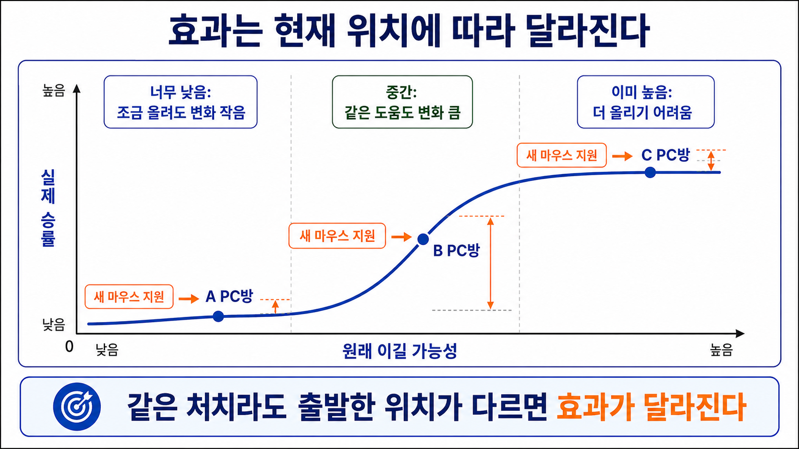

# 25장. 같은 도움도 위치에 따라 다르게 보인다

## 승률이 낮은 곳을 먼저 도와야 할까

PC방 회사가 새 마우스 지원 대상을 고르려고 한다.

지금까지 배운 대로라면 질문은 이렇게 보인다.

```text
새 마우스를 주면 승률이 가장 많이 오를 PC방은 어디일까?
```

데이터팀은 PC방을 세 그룹으로 나눴다.

| PC방 그룹 | 현재 승률 |
| --- | ---: |
| A | 5% |
| B | 50% |
| C | 95% |

처음 보면 A를 도와야 할 것 같다.

승률이 너무 낮으니 올릴 여지가 많아 보인다.

또 C는 이미 95%니까 별로 도울 필요가 없어 보인다.

그런데 여기서 반박이 나온다.

```text
승률이 낮다고 해서 잘 오르는 건 아닐 수 있다.
이미 너무 낮거나 너무 높으면, 같은 도움도 숫자로는 작게 보일 수 있다.
```

이번 장의 핵심은 이것이다.

효과는 사람마다 다를 수 있을 뿐 아니라, 지금 어디에 있는지에 따라서도 달라질 수 있다.

## 숫자는 0% 아래로도, 100% 위로도 못 간다

승률이나 전환율처럼 0%와 100% 사이에 갇힌 결과를 생각해 보자.

앱 설치 여부, 구매 여부, 게임 승패, 가입 여부가 모두 이런 결과다.

이런 결과는 편하다.

성공했으면 1, 실패했으면 0으로 기록하면 된다.

하지만 인과 효과를 볼 때는 까다롭다.

왜냐하면 결과가 아래와 위에서 막혀 있기 때문이다.

예를 들어 현재 승률이 95%인 PC방이 있다.

새 마우스가 아무리 좋아도 승률을 120%로 만들 수는 없다.

최대로 올라가도 100%다.

반대로 현재 승률이 5%인 PC방도 있다.

장비 하나만 바꾼다고 갑자기 50%까지 오르기는 어려울 수 있다.

너무 낮은 곳에서는 다른 문제가 많을 가능성이 크다.

그래서 같은 새 마우스라도 가운데 근처에서 더 크게 보일 수 있다.

| 현재 승률 | 새 마우스 뒤 승률 | 변화 |
| ---: | ---: | ---: |
| 5% | 7% | +2%p |
| 50% | 60% | +10%p |
| 95% | 97% | +2%p |

새 마우스는 세 그룹에 똑같이 도움을 줬다고 하자.

그래도 관측되는 변화는 다르게 보일 수 있다.

## 중간에서는 같은 도움도 크게 보인다

전환율이나 승률은 보통 직선처럼 움직이지 않는다.

낮은 곳에서는 잘 안 움직이다가, 어느 구간에서 빠르게 움직이고, 높은 곳에서는 다시 천천히 움직인다.

이 모양을 흔히 S자 곡선으로 생각할 수 있다.

그림이 있다면 왼쪽, 가운데, 오른쪽을 차례로 보면 된다.

왼쪽은 이미 너무 낮은 구간이다.

가운데는 작은 변화도 결과에 크게 반영되는 구간이다.

오른쪽은 이미 너무 높은 구간이다.

```text
너무 낮음 -> 변화 작음
중간 -> 변화 큼
너무 높음 -> 변화 작음
```

그래서 “누가 효과가 큰가?”라는 질문은 단순히 “누가 원래 승률이 낮은가?”와 같지 않다.

원래 승률이 낮아도 변화가 작을 수 있다.

원래 승률이 높아도 변화가 작을 수 있다.

중간에 있는 그룹이 가장 크게 움직일 수 있다.

그림에서는 A, B, C 세 PC방의 위치를 비교하면 된다.

A는 너무 낮은 구간에 있어서 새 마우스를 줘도 변화가 작게 보인다.

B는 가운데 가파른 구간에 있어서 같은 지원도 승률 변화가 크게 보인다.

C는 이미 높은 구간에 있어서 더 올리기 어렵다.



## 원래 승률이 효과처럼 보일 수 있다

여기서 더 헷갈리는 일이 생긴다.

어떤 정보는 새 마우스 효과를 직접 바꾸지 않는다.

그런데도 효과가 다른 것처럼 보이게 만들 수 있다.

예를 들어 `기존 승률`이 높은 PC방과 낮은 PC방이 있다고 하자.

기존 승률은 다음 달 승률을 잘 예측한다.

하지만 기존 승률이 새 마우스의 성능 자체를 바꾼다고 말하기는 어렵다.

그런데 결과가 0%와 100% 사이에 갇혀 있으면, 기존 승률이 높은지 낮은지만으로도 관측 효과가 달라질 수 있다.

| 기존 승률 위치 | 같은 새 마우스를 줬을 때 보이는 변화 |
| --- | ---: |
| 너무 낮음 | 작게 보일 수 있음 |
| 중간 | 크게 보일 수 있음 |
| 너무 높음 | 작게 보일 수 있음 |

이때 기존 승률은 새 마우스 성능을 직접 바꾸는 원인이 아닐 수 있다.

그런데 결과 곡선의 모양 때문에 효과가 달라 보인다.

이것이 이 장의 어려운 지점이다.

```text
효과가 정말 다르기 때문인가?
아니면 결과가 0%와 100% 사이에 갇혀 있어서 그렇게 보이는가?
```

## 정말 다르게 반응한 걸까

20장에서 우리는 효과 이질성을 봤다.

효과 이질성은 사람이나 집단마다 처치 효과가 다르게 나타나는 현상이다.

예를 들어 손 크기가 작은 유저에게는 가벼운 마우스가 더 도움이 되고, 손이 큰 유저에게는 별 차이가 없을 수 있다.

이 경우에는 손 크기가 효과 차이를 만든다고 볼 수 있다.

하지만 이번 장의 문제는 조금 다르다.

기존 승률이 5%, 50%, 95%인 그룹을 다시 보자.

가운데 그룹의 변화가 가장 크다고 해서, 꼭 그 그룹만 새 마우스와 특별히 잘 맞는다는 뜻은 아니다.

그냥 그 그룹이 결과 곡선에서 가장 잘 움직이는 위치에 있을 수도 있다.

그래서 두 질문을 나눠야 한다.

```text
1. 이 집단은 처치에 정말 다르게 반응하는가?
2. 아니면 원래 결과 수준이 달라서 변화가 다르게 보이는가?
```

두 질문을 섞으면 정책이 이상해질 수 있다.

## 평균이 낮으면 어느 정도 가능성 있는 사람이 움직인다

이번에는 앱 설치 이벤트를 생각해 보자.

회사 평균 설치율이 5%밖에 안 된다고 하자.

대부분의 사람은 앱을 설치하지 않는다.

이때 할인 쿠폰을 누구에게 줄까?

설치 가능성이 거의 0%인 사람에게 주면 변화가 작을 수 있다.

애초에 관심이 거의 없기 때문이다.

반대로 설치 가능성이 15%인 사람은 아직 낮은 편이지만, 0%에 가까운 사람보다는 움직일 여지가 있다.

그래서 평균 설치율이 낮은 서비스에서는 `원래 설치 가능성이 조금 있는 사람`이 더 좋은 대상처럼 보일 수 있다.

여기서 중요한 것은 “높은 사람에게 무조건 주자”가 아니다.

현재 서비스가 0%에 가까운 쪽에 있는지, 100%에 가까운 쪽에 있는지 봐야 한다는 것이다.

낮은 쪽에 몰려 있으면, 너무 낮은 사람보다 어느 정도 가능성이 있는 사람이 더 움직일 수 있다.

## 이미 높으면 더 올리기 어렵다

이번에는 평균 설치율이 이미 90%인 서비스를 생각해 보자.

대부분의 사람은 그냥 설치한다.

이때 원래 설치 가능성이 98%인 사람에게 쿠폰을 주면 어떨까?

어차피 설치할 가능성이 높다.

쿠폰이 추가로 만들 수 있는 변화는 작을 수 있다.

반대로 원래 설치 가능성이 70%인 사람은 아직 움직일 여지가 더 있다.

그래서 평균 설치율이 높은 서비스에서는, 이미 거의 설치할 사람보다 아직 조금 더 설득할 여지가 있는 사람이 더 좋아 보일 수 있다.

정리하면 이렇다.

```text
결과가 0%나 100%에 가까우면 변화가 작게 보일 수 있다.
중간에 가까울수록 같은 도움도 크게 보일 수 있다.
```

이 말은 절대 법칙이 아니다.

하지만 전환율, 승률, 구매 여부처럼 0과 1 사이의 결과를 볼 때 매우 자주 나타나는 문제다.

## 가격은 어느 구간을 바꾸는지도 봐야 한다

지금까지는 새 마우스를 받았는가, 받지 않았는가처럼 둘 중 하나인 처치를 봤다.

하지만 현실에는 양이 있는 처치도 많다.

가격을 5천원, 1만원, 1만5천원으로 바꾸는 일이 그렇다.

할인율을 5%, 10%, 20%로 바꾸는 일도 그렇다.

이때는 질문이 더 복잡해진다.

```text
가격을 1만원에서 9천원으로 낮출 때의 효과
가격을 5천원에서 4천원으로 낮출 때의 효과
```

두 변화의 효과가 같을까?

같지 않을 수 있다.

이미 매우 싼 가격에서는 1천원을 더 낮춰도 변화가 작을 수 있다.

반대로 비싸다고 느끼던 구간에서는 1천원 차이가 크게 작동할 수 있다.

즉 효과는 고객 유형뿐 아니라 현재 가격에도 달라질 수 있다.

```text
누구인가?
현재 어느 가격에 있는가?
어느 가격으로 바꾸려는가?
```

이 세 가지가 함께 들어간다.

그래서 양이 있는 처치에서는 “이 고객은 가격 변화에 크게 반응한다”라는 말도 조심해야 한다.

어느 가격 구간에서 크게 반응하는지까지 봐야 한다.

## 같은 구간을 비교했는지 확인해야 한다

가격 실험에서 가장 위험한 실수는 서로 다른 구간을 비교하는 것이다.

예를 들어 A그룹에는 1만원과 1만5천원만 실험했다.

B그룹에는 5천원과 1만원만 실험했다.

그다음 두 그룹이 가격 변화에 얼마나 크게 반응하는지 비교하면 어떻게 될까?

겉으로는 A와 B를 비교하는 것처럼 보인다.

하지만 실제로는 다른 가격 구간을 비교하고 있다.

| 그룹 | 실험한 가격 구간 |
| --- | --- |
| A | 1만원 -> 1만5천원 |
| B | 5천원 -> 1만원 |

이 상태에서 A가 가격 변화에 더 크게 반응한다거나 B가 더 크게 반응한다고 말하면 위험하다.

고객 유형 차이 때문인지, 가격 구간 차이 때문인지 구분하기 어렵기 때문이다.

그래서 결과가 직선처럼 움직이지 않을 때는 이 질문을 먼저 해야 한다.

```text
두 집단을 같은 처치 구간에서 비교했는가?
```

같은 구간을 보지 않았다면, 효과 차이는 집단 차이가 아니라 구간 차이일 수 있다.

## 작은 계산으로 막힌 결과를 확인한다

아래 코드는 같은 도움을 줘도 0%와 100%에 가까운 곳에서는 변화가 작게 보일 수 있음을 보여준다.

```python
groups = [
    {"group": "A", "baseline": 5, "after_help": 7},
    {"group": "B", "baseline": 50, "after_help": 60},
    {"group": "C", "baseline": 95, "after_help": 97},
]

for row in groups:
    change = row["after_help"] - row["baseline"]
    print(row["group"], change)
```

출력은 이렇게 읽으면 된다.

```text
A 2
B 10
C 2
```

같은 도움이라도 B에서 변화가 가장 크게 보인다.

이것만 보고 B만 새 마우스와 특별히 잘 맞는다고 결론내리면 성급하다.

B가 결과 곡선에서 가장 잘 움직이는 위치에 있었을 수도 있다.

## 다음 장으로

이번 장에서는 효과가 달라 보이는 이유가 두 가지일 수 있음을 봤다.

```text
집단이 정말 다르게 반응한다.
결과 곡선의 위치가 달라서 다르게 보인다.
```

전환율, 승률, 구매 여부처럼 0과 1 사이에 갇힌 결과에서는 이 문제가 특히 중요하다.

가격이나 할인율처럼 양이 있는 처치에서는 현재 처치 수준까지 함께 봐야 한다.

다음 장부터는 시간에 따른 비교로 넘어간다.

한 시점의 집단 비교가 아니라, 처치 전후의 변화와 비교 집단의 변화를 함께 보는 방법을 다룬다.

## 한 줄 요약

효과가 달라 보이면 집단이 정말 다르게 반응한 것인지, 결과의 현재 위치나 처치 구간 때문에 그렇게 보이는 것인지 먼저 구분해야 한다.
