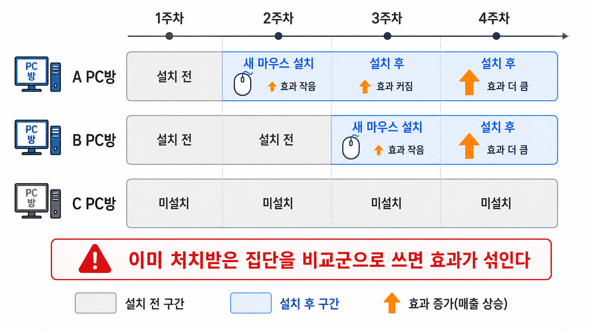

# 26장. 먼저 설치한 곳을 비교 대상으로 써도 될까

## 한 번에 설치하지 못했다

새 마우스 회사가 여러 PC방에 장비를 지원하려고 한다.

15장에서는 일부 PC방은 새 마우스를 설치했고, 일부 PC방은 설치하지 않았다. 그리고 설치 전후 변화를 비교했다.

이번에는 상황이 조금 더 현실적이다. 모든 PC방에 같은 날 설치하지 못했다. 일정, 물류, 계약 문제 때문에 PC방마다 설치 시점이 달라졌다.

| PC방 | 1주차 | 2주차 | 3주차 | 4주차 |
| --- | --- | --- | --- | --- |
| A | 기존 | 새 마우스 | 새 마우스 | 새 마우스 |
| B | 기존 | 기존 | 새 마우스 | 새 마우스 |
| C | 기존 | 기존 | 기존 | 기존 |

그림에서는 먼저 A, B, C의 설치 시점이 서로 다르다는 점을 본다.

A는 2주차부터 설치 후 구간으로 들어간다. B는 3주차부터 들어간다. C는 끝까지 미설치 상태로 남아 있다.

그다음 설치 후 시간이 지나며 효과가 달라질 수 있다는 점을 본다. 설치 직후에는 효과가 작고, 시간이 지나며 손님들이 적응하면서 효과가 커질 수 있다.



처음 보면 자료가 더 좋아진 것 같다. PC방도 여러 개 있고, 시간도 여러 주 있다.

그래서 누군가 이렇게 말한다.

```text
이 정도면 DID를 여러 PC방과 여러 주차에 한 번에 적용하면 되지 않을까?
PC방 차이도 빼고, 주차 차이도 빼면 되잖아.
```

이 제안은 자연스럽다. 하지만 여기서 새로운 문제가 생긴다.

```text
이미 새 마우스를 받은 PC방을,
아직 새 마우스를 받지 않은 PC방의 비교 대상으로 써도 될까?
```

이 장의 질문은 여기서 시작한다.

## DID가 약속했던 비교를 다시 보자

15장에서 DID는 두 가지 비교를 같이 썼다.

```text
처치 전후 변화
처치 집단과 비교 집단의 차이
```

이 두 비교를 함께 쓰면, 단순 전후 비교보다 낫다. 그 기간에 모두에게 생긴 변화를 어느 정도 뺄 수 있기 때문이다.

예를 들어 새 마우스를 설치한 PC방이 9%p 올랐고, 설치하지 않은 PC방도 6%p 올랐다면 이렇게 읽었다.

```text
새 마우스 설치 PC방 변화 = +9%p
기존 PC방 변화 = +6%p
차이의 차이 = +3%p
```

여기서 기존 PC방은 새 마우스를 받지 않았다. 그래서 그 기간의 전체 변화, 예를 들어 게임 패치나 시즌 변화가 얼마나 있었는지 알려 주는 비교 대상이 된다.

DID가 믿을 만하려면 비교 대상이 중요하다. 처치가 없었다면 설치 PC방도 기존 PC방과 비슷한 방향으로 변했을 것이라고 생각해야 한다.

이 생각을 평행 추세라고 부른다. 영어로는 `parallel trends`다.

## 여러 시점에 설치하면 비교 대상이 계속 바뀐다

이제 A, B, C 세 PC방을 다시 보자.

2주차에 A가 새 마우스를 받았다. 이때 B와 C는 아직 기존 마우스를 쓰고 있다.

그러면 1주차에서 2주차로 넘어가는 A의 변화를 볼 때, B와 C는 비교 대상으로 쓸 수 있다. 아직 처치받지 않았기 때문이다.

| 비교 시점 | 새 마우스 받은 쪽 | 아직 받지 않은 쪽 |
| --- | --- | --- |
| 1주차 -> 2주차 | A | B, C |

여기까지는 비교의 의미가 비교적 분명하다.

문제는 3주차부터다. 3주차에는 B도 새 마우스를 받는다.

이제 B의 효과를 보려고 할 때, A는 이미 2주차부터 새 마우스를 쓰고 있었다.

| 비교 시점 | 새로 받은 쪽 | 이미 받은 쪽 | 아직 안 받은 쪽 |
| --- | --- | --- | --- |
| 2주차 -> 3주차 | B | A | C |

여기서 A를 비교 대상으로 쓰면 문제가 생긴다.

A는 더 이상 기존 상태가 아니다. 이미 새 마우스 효과를 받고 있다.

비교 대상은 처치를 받지 않은 상태를 대신 보여줘야 한다. 그런데 A는 이미 처치받은 상태다.

그러면 B와 A를 비교하는 순간, 우리는 이런 것을 섞게 된다.

```text
B가 새로 받은 효과
A가 이미 받은 효과
두 PC방의 원래 차이
그 주에 모두에게 생긴 변화
```

이 비교는 “B가 새 마우스를 받지 않았다면 어떻게 변했을까?”라는 질문에 깔끔하게 답하지 못한다.

## 효과가 시간이 지나며 달라지면 더 문제가 된다

그래도 누군가는 이렇게 생각할 수 있다.

```text
A도 새 마우스를 받았고 B도 새 마우스를 받았으니,
둘을 비교해도 어느 정도 정보가 있지 않을까?
```

효과가 모든 PC방에서 항상 같은 크기라면 문제가 덜할 수 있다. 하지만 현실에서는 효과가 바로 같은 크기로 나타나지 않는다.

새 마우스를 처음 설치한 날에는 손에 익숙하지 않을 수 있다. 며칠 지나면 손님들이 적응한다. 설정도 맞춰진다.

그러면 효과는 시간이 지나며 커질 수 있다.

| 설치 후 지난 시간 | 승률 변화 |
| --- | ---: |
| 설치 직후 | +1%p |
| 1주 후 | +3%p |
| 2주 후 | +5%p |

B는 3주차에 막 설치했다. A는 3주차에 이미 설치 1주 후다.

이때 B와 A를 비교하면, 새 마우스 있음과 없음만 비교하는 것이 아니다.

```text
B: 설치 직후 효과
A: 설치 1주 후 효과
```

이 둘을 빼면 해석하기 어려운 숫자가 나온다. 마우스 효과가 있는지 없는지를 보는 것이 아니라, 효과가 자라나는 단계 차이를 함께 보고 있기 때문이다.

## 평균 하나가 여러 비교를 섞는다

여러 PC방과 여러 주차가 있으면 회귀로 한 번에 계산하고 싶어진다.

PC방마다 원래 실력이 다르니 PC방 차이를 빼고, 주차마다 전체 분위기가 다르니 주차 차이도 빼고, 남은 차이에서 새 마우스 효과를 읽자는 생각이다.

이 방식은 이중 고정효과라고 부른다. 영어 약어로는 `TWFE`다. 풀어 쓰면 `Two-Way Fixed Effects`다.

말은 어렵지만 생각은 16장에서 본 고정효과와 이어진다.

```text
PC방마다 원래 다른 수준을 뺀다.
주차마다 모두에게 생긴 변화를 뺀다.
그 뒤 새 마우스 여부의 차이를 본다.
```

문제는 이 계산이 여러 작은 DID 비교를 한 숫자로 섞는다는 것이다.

섞이는 비교에는 괜찮은 비교도 있고, 조심해야 하는 비교도 있다.

| 비교 | 해석하기 쉬운가? | 이유 |
| --- | --- | --- |
| A vs C | 상대적으로 낫다 | C는 아직 받지 않았다 |
| B vs C | 상대적으로 낫다 | C는 아직 받지 않았다 |
| B vs A | 조심해야 한다 | A는 이미 받았다 |

특히 효과가 시간이 지나며 달라지면, 이미 받은 집단을 비교 대상으로 쓰는 비교가 전체 평균을 잘못 만들 수 있다.

그래서 TWFE의 숫자 하나를 바로 “평균 효과”라고 부르면 안 된다. 그 숫자 안에는 여러 비교가 들어 있고, 그중 일부는 우리가 원한 비교가 아닐 수 있다.

## 효과가 커지는 중이면 평균이 작아질 수 있다

새 마우스 효과가 시간이 지나며 커진다고 하자.

A는 먼저 설치했기 때문에 효과가 어느 정도 커진 상태다. B는 나중에 설치했기 때문에 이제 막 효과가 시작된다.

이때 A를 B의 비교 대상으로 쓰면 어떤 일이 생길까?

B의 처치 후 결과를 A와 비교하게 된다. 그런데 A는 이미 효과를 받고 있어서 결과가 올라가 있다.

그러면 B가 좋아진 정도가 실제보다 작게 보일 수 있다.

작은 표로 보면 이렇다.

| PC방 | 상태 | 새 마우스 효과 |
| --- | --- | ---: |
| B | 막 설치함 | +1%p |
| A | 이미 설치 1주 후 | +3%p |

B를 A와 비교하면 B가 덜 좋아진 것처럼 보일 수 있다.

하지만 그건 B가 효과를 못 받은 것이 아니다. 두 PC방이 처치 후 지난 시간이 다르기 때문이다.

이런 비교가 여러 번 섞이면, 최종 평균 효과가 실제보다 작아질 수 있다. 경우에 따라서는 방향까지 잘못 보일 수 있다.

## 상대 시점으로 펼쳐 보면 문제가 보인다

이 문제를 보려면 “몇 주차인가?”만 보면 부족하다.

각 PC방이 새 마우스를 받은 시점을 기준으로 다시 봐야 한다.

A에게 2주차는 설치 직후다. B에게 3주차가 설치 직후다.

그래서 이렇게 바꿔 볼 수 있다.

| PC방 | 실제 주차 | 설치 기준 시점 |
| --- | ---: | --- |
| A | 1주차 | 설치 1주 전 |
| A | 2주차 | 설치 직후 |
| A | 3주차 | 설치 1주 후 |
| B | 2주차 | 설치 1주 전 |
| B | 3주차 | 설치 직후 |
| B | 4주차 | 설치 1주 후 |

이렇게 처치 시점을 기준으로 전후를 펼쳐 보는 방식을 이벤트 스터디라고 부른다. 영어로는 `event study`다.

여기서 이벤트는 새 마우스 설치다.

이벤트 스터디가 묻는 질문은 단순하다.

```text
설치 전에는 두 집단이 비슷하게 움직였는가?
설치 직후에는 얼마나 달라졌는가?
설치 후 시간이 지나며 효과가 어떻게 변했는가?
```

이 방식은 평균 하나로 숨겨진 시간 모양을 보여 준다.

그래서 효과가 바로 생기는지, 천천히 커지는지, 설치 전부터 이미 차이가 있었는지 확인하는 데 도움이 된다.

하지만 이벤트 스터디 하나만 붙인다고 모든 문제가 사라지는 것은 아니다. 비교 대상이 이미 처치받은 집단이면 같은 문제가 다시 들어올 수 있다.

## 더 유연하게 보되, 비교 조건은 남는다

해결 방향은 억지로 효과 하나만 추정하지 않는 것이다.

PC방마다, 설치 시점마다, 설치 후 지난 시간마다 효과가 달라질 수 있다고 열어 둔다.

예를 들어 이렇게 말하는 편이 더 정확하다.

```text
A처럼 2주차에 설치한 PC방의 설치 직후 효과
A처럼 2주차에 설치한 PC방의 설치 1주 후 효과
B처럼 3주차에 설치한 PC방의 설치 직후 효과
B처럼 3주차에 설치한 PC방의 설치 1주 후 효과
```

이렇게 나누면 평균 하나가 무엇을 섞는지 더 잘 보인다.

효과가 시간이 지나며 커지는지, 특정 시점에만 큰지, 도입 시점이 다른 집단에서 다르게 나타나는지도 볼 수 있다.

하지만 이것으로 모든 문제가 해결되지는 않는다. 더 유연하게 나눈다고 해서 비교가 자동으로 공정해지는 것은 아니다.

여전히 물어야 한다.

```text
아직 처치받지 않은 집단이 적절한 비교 대상인가?
처치가 없었다면 두 집단은 비슷한 방향으로 변했을까?
처치 전에 이미 다른 변화가 시작된 것은 아닌가?
처치와 같은 시점에 다른 일이 같이 생긴 것은 아닌가?
```

DID는 계산 방법이 아니라 비교 설계다. 계산을 유연하게 바꾸어도, 비교할 집단이 믿을 만해야 한다.

## 다음 장으로

이번 장에서는 여러 시점에 처치가 들어올 때 기존 DID가 무엇을 섞을 수 있는지 봤다.

중심은 하나다.

```text
비교 대상은 처치받지 않은 상태를 대신 보여줘야 한다.
```

그런데 이미 처치받은 집단을 비교 대상으로 쓰면, 효과가 시간에 따라 달라질 때 평균이 잘못될 수 있다.

다음 장에서는 이 문제를 줄이기 위해 DID와 synthetic control을 함께 쓰는 방법을 본다.

단순히 전후 변화만 보는 것도 아니고, 단순히 가상의 비교 대상만 만드는 것도 아니다. 둘을 함께 써서 더 나은 비교를 만들려는 방법이다.

## 한 줄 요약

여러 집단이 서로 다른 시점에 처치받고 효과도 시간에 따라 달라지면, 기존 DID 평균은 이미 처치받은 집단까지 비교 대상으로 섞어 잘못된 효과를 만들 수 있다.
