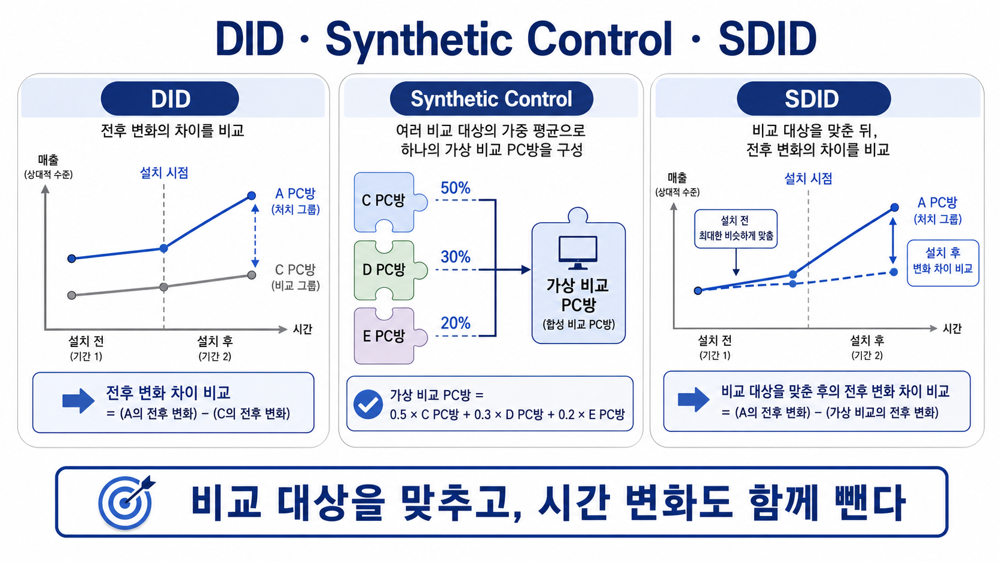

# 27장. 비교 대상을 맞추고 시간 변화도 뺀다

## 둘 중 하나만으로는 아쉬울 때가 있다

장비 회사가 스타 PC방에 새 마우스를 먼저 설치했다.

회사는 설치 후 승률이 얼마나 올랐는지 알고 싶다.

자료는 여러 주 동안 있다.

비교할 PC방도 여러 곳 있다.

이제 우리는 두 가지 방법을 이미 안다.

```text
DID: 설치 전후 변화와 비교 PC방의 변화를 함께 본다.
synthetic control: 여러 PC방을 섞어 스타 PC방과 비슷한 비교 대상을 만든다.
```

둘 다 좋은 생각이다.

하지만 각각 아쉬운 점이 있다.

DID는 비교 PC방 평균이 스타 PC방과 비슷하게 움직인다고 믿어야 한다.

그런데 설치 전부터 스타 PC방의 흐름이 비교 PC방 평균과 다르면 위험하다.

synthetic control은 설치 전 흐름을 잘 맞출 수 있다.

하지만 설치 전후의 전체 변화, 주차별 변동, PC방마다 원래 다른 수준을 함께 정리하는 데는 DID의 생각이 유용하다.

그래서 회의실에서 이런 질문이 나온다.

```text
비교 PC방을 그냥 평균내지 말고 잘 섞자.
그다음 전후 변화 차이도 같이 보자.
```

이 장은 그 생각을 다룬다.

이름은 synthetic difference-in-differences다.

줄여서 `SDID`라고 부른다.

## 먼저 그냥 DID를 쓰면 무엇이 남을까

작은 숫자로 보자.

스타 PC방은 4주차부터 새 마우스를 설치했다.

| 주차 | 스타 PC방 | 비교 PC방 평균 |
| --- | ---: | ---: |
| 1주차 | 52% | 48% |
| 2주차 | 54% | 49% |
| 3주차 | 55% | 50% |
| 4주차 | 66% | 52% |
| 5주차 | 68% | 53% |

DID는 전후 변화를 비교한다.

스타 PC방은 설치 전 평균이 약 54%이고, 설치 후 평균이 67%다.

변화는 +13%p다.

비교 PC방 평균은 설치 전 약 49%이고, 설치 후 약 53%다.

변화는 +4%p다.

그러면 DID는 이렇게 읽는다.

```text
스타 PC방 변화 = +13%p
비교 PC방 평균 변화 = +4%p
차이 = +9%p
```

문제는 설치 전 흐름이다.

스타 PC방은 52%, 54%, 55%로 움직였다.

비교 PC방 평균은 48%, 49%, 50%로 움직였다.

수준도 다르고, 움직임도 완전히 같다고 보기 어렵다.

비교 PC방 평균이 스타 PC방의 반사실을 잘 대신한다고 말하기에는 불안하다.

## 그냥 synthetic control을 쓰면 무엇이 남을까

이번에는 17장에서 본 방식으로 여러 PC방을 섞어 보자.

비교 PC방 B, C, D를 이런 비율로 섞었다고 하자.

```text
B 20%
C 30%
D 50%
```

이 비율을 쓰면 설치 전 흐름이 스타 PC방과 더 비슷해진다.

| 주차 | 스타 PC방 | 섞어서 만든 비교 대상 |
| --- | ---: | ---: |
| 1주차 | 52% | 52.0% |
| 2주차 | 54% | 53.5% |
| 3주차 | 55% | 55.0% |
| 4주차 | 66% | 58.0% |
| 5주차 | 68% | 60.0% |

설치 전에는 꽤 잘 맞는다.

이제 설치 후 차이를 보면 된다.

```text
4주차 차이 = 66 - 58 = 8%p
5주차 차이 = 68 - 60 = 8%p
```

synthetic control은 비교 대상을 잘 맞추는 데 강하다.

하지만 여기서도 질문이 남는다.

주차마다 모두에게 생긴 변화는 어떻게 처리할까?

특정 주에 게임 패치가 있었거나, 방학이 시작됐거나, 전체 플레이 시간이 달라졌다면 어떻게 할까?

이때 DID가 하던 생각이 다시 필요하다.

```text
비교 대상을 잘 맞춘다.
그래도 전후 변화 차이를 함께 본다.
```

## 그래서 둘을 같이 쓴다

SDID의 생각은 한 문장으로 말할 수 있다.

```text
비교 대상을 합성 통제집단처럼 맞추고,
효과는 DID처럼 전후 변화 차이로 읽는다.
```

먼저 설치 전을 본다.

비교 PC방들을 그냥 평균내지 않는다.

스타 PC방과 설치 전 흐름이 비슷해지도록 비율을 정한다.

이 비율을 단위 가중치라고 부를 수 있다.

영어로는 `unit weights`다.

여기서 단위는 PC방이다.

그다음 시간도 그냥 똑같이 보지 않는다.

설치 전 기간 중에서도 설치 후 기간과 비교할 때 더 도움이 되는 주차가 있을 수 있다.

예를 들어 1주차보다 3주차가 설치 직전 상태를 더 잘 보여 줄 수 있다.

SDID는 이런 시간 쪽 비중도 생각한다.

이것을 시간 가중치라고 부를 수 있다.

영어로는 `time weights`다.

하지만 처음 읽을 때는 이름보다 역할이 중요하다.

```text
PC방 가중치: 어떤 비교 PC방을 얼마나 섞을까?
시간 가중치: 설치 전 어느 시점을 더 중요하게 볼까?
```

이 둘을 정한 뒤, DID처럼 전후 변화 차이를 읽는다.

그래서 SDID는 DID와 synthetic control을 단순히 옆에 붙인 것이 아니다.

둘의 질문을 한 번에 묻는 방식이다.

## 세 장면으로 나누어 보면



첫 번째 장면은 DID다.

처치받은 PC방과 비교 PC방의 전후 변화를 비교한다.

하지만 비교 PC방 평균이 처치받은 PC방과 설치 전부터 다르게 움직이면 불안하다.

두 번째 장면은 synthetic control이다.

여러 비교 PC방에 비율을 붙여, 설치 전 흐름이 처치받은 PC방과 비슷한 비교 대상을 만든다.

세 번째 장면이 SDID다.

설치 전에는 합성 비교 대상이 처치받은 PC방과 비슷하게 움직이도록 맞춘다.

그리고 설치 후에는 두 선의 전후 변화 차이를 본다.

가장 중요한 문장은 이것이다.

```text
비교 대상을 맞추고, 시간 변화도 함께 뺀다.
```

## 작은 표로 SDID의 순서를 잡아 보자

스타 PC방과 세 비교 PC방이 있다.

새 마우스는 4주차부터 설치됐다.

| PC방 | 1주차 | 2주차 | 3주차 | 4주차 | 5주차 |
| --- | ---: | ---: | ---: | ---: | ---: |
| 스타 | 52 | 54 | 55 | 66 | 68 |
| B | 48 | 49 | 50 | 52 | 53 |
| C | 56 | 57 | 59 | 61 | 62 |
| D | 51 | 53 | 54 | 57 | 58 |

첫 단계는 비교 PC방을 섞는 것이다.

예를 들어 C 20%, D 80%를 섞으면 설치 전 흐름이 스타 PC방과 매우 비슷해진다.

| 주차 | 스타 | C 20% + D 80% |
| --- | ---: | ---: |
| 1주차 | 52 | 52.0 |
| 2주차 | 54 | 53.8 |
| 3주차 | 55 | 55.0 |

두 번째 단계는 설치 후를 본다.

같은 비율을 4주차와 5주차에도 적용한다.

| 주차 | 스타 | 합성 비교 대상 | 차이 |
| --- | ---: | ---: | ---: |
| 4주차 | 66 | 57.8 | 8.2 |
| 5주차 | 68 | 58.8 | 9.2 |

이 숫자만 보면 synthetic control과 비슷하다.

SDID는 여기에 DID의 생각을 더한다.

설치 전후의 전체 시간 변화와 PC방별 원래 수준 차이를 함께 정리한다.

그래서 질문은 이렇게 된다.

```text
설치 전에는 스타 PC방과 비슷한 비교 대상을 만들었는가?
설치 후에는 그 비교 대상과 스타 PC방의 변화 차이가 얼마나 벌어졌는가?
```

이 두 질문을 같이 묻는 것이 SDID의 핵심이다.

## 여러 시점에 설치되면 나눠서 본다

26장에서 본 것처럼, 모든 PC방이 같은 주차에 새 마우스를 받지는 않는다.

A는 2주차에 받고, B는 3주차에 받고, C는 받지 않을 수 있다.

이런 상황을 그대로 한 덩어리로 보면 비교군이 애매해진다.

A는 B의 비교군이 될 수 있는가?

B는 A의 비교군이 될 수 있는가?

처치 시점이 다르면 `설치 전`과 `설치 후`의 뜻도 집단마다 달라진다.

SDID에서는 이런 경우 문제를 작은 덩어리로 나눠 볼 수 있다.

예를 들어 2주차에 설치한 집단을 볼 때는 이렇게 만든다.

```text
2주차 설치 집단
아직 설치하지 않은 집단
2주차 기준의 설치 전/후
```

3주차에 설치한 집단을 볼 때는 다시 이렇게 만든다.

```text
3주차 설치 집단
아직 설치하지 않은 집단
3주차 기준의 설치 전/후
```

각 덩어리 안에서는 다시 SDID를 쓴다.

그리고 각 덩어리의 효과를 합친다.

이때 많이 관측된 처치 기간은 더 크게 반영할 수 있다.

중요한 것은 한 번에 모든 것을 섞지 않는 것이다.

처치 시점이 다르면, 비교 문제도 시점별로 다시 정리해야 한다.

## 불확실성도 그냥 회귀표를 믿으면 안 된다

SDID는 비교 대상을 만들기 위해 가중치를 추정한다.

비교 PC방을 얼마나 섞을지 정한다.

설치 전 어느 시점을 더 중요하게 볼지도 정한다.

그러면 최종 효과 숫자는 이 가중치 추정의 영향을 받는다.

그래서 단순한 회귀표의 표준오차를 그대로 믿으면 위험하다.

그 표준오차는 가중치를 찾는 과정의 흔들림을 충분히 반영하지 못할 수 있다.

한 가지 확인 방법은 placebo다.

여기서 placebo는 진짜 처치받지 않은 PC방을 일부러 처치받은 것처럼 놓고 같은 계산을 해 보는 것이다.

예를 들어 C PC방은 새 마우스를 받지 않았다.

그런데 분석에서는 C가 4주차에 받은 것처럼 표시해 본다.

그렇게 해도 큰 효과가 자주 나온다면, 실제 분석에서 나온 효과도 조심해서 봐야 한다.

반대로 가짜 처치에서는 효과가 작고, 진짜 처치에서만 큰 효과가 보이면 더 설득력이 생긴다.

placebo는 이런 질문을 확인한다.

```text
이 방법은 처치가 없던 곳에서도 큰 효과를 자주 만들어 내는가?
```

자주 만들어 낸다면 방법이 너무 쉽게 효과를 찾는 것일 수 있다.

## 방법이 늘어도 확인할 것은 남는다

SDID는 매력적이다.

DID처럼 시간 변화와 단위 차이를 정리한다.

synthetic control처럼 비교 대상을 맞춘다.

하지만 그래서 무조건 더 믿을 만한 방법이라고 말하면 안 된다.

비교 PC방을 섞어도 설치 전 흐름이 잘 맞지 않을 수 있다.

시간 가중치를 써도 중요한 기간을 잘못 강조할 수 있다.

가중치가 특정 PC방이나 특정 주차에 너무 몰리면 해석이 어려워질 수 있다.

그리고 여전히 가장 중요한 질문은 남는다.

```text
새 마우스가 없었다면 스타 PC방은 합성 비교 대상처럼 변했을까?
```

이 질문을 믿을 수 없으면 SDID도 믿기 어렵다.

방법 이름이 바뀌어도 인과추론의 중심은 그대로다.

믿을 만한 비교를 만들었는가?

## 다음 장으로

이번 장에서는 DID와 synthetic control을 함께 쓰는 생각을 봤다.

DID는 전후 변화 차이를 본다.

synthetic control은 비교 대상을 잘 맞춘다.

SDID는 이 둘을 함께 써서, 설치 전에는 비교 대상을 맞추고 설치 후에는 변화 차이를 읽는다.

여기까지 오면 시간 비교와 개인별 효과 추정의 큰 흐름은 거의 잡혔다.

다음에는 남은 장들을 어떻게 정리할지 봐야 한다.

특히 불확실성, 검정, 그리고 모델이 만든 결론을 얼마나 믿을지의 문제가 남아 있다.

## 한 줄 요약

SDID는 비교 PC방을 설치 전 흐름에 맞게 섞고, 그 합성 비교 대상과 처치 집단의 전후 변화 차이를 함께 보려는 방법이다.
